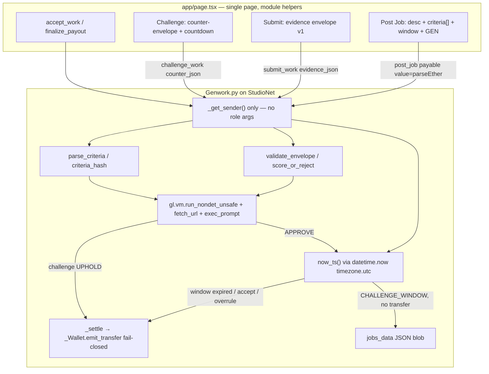
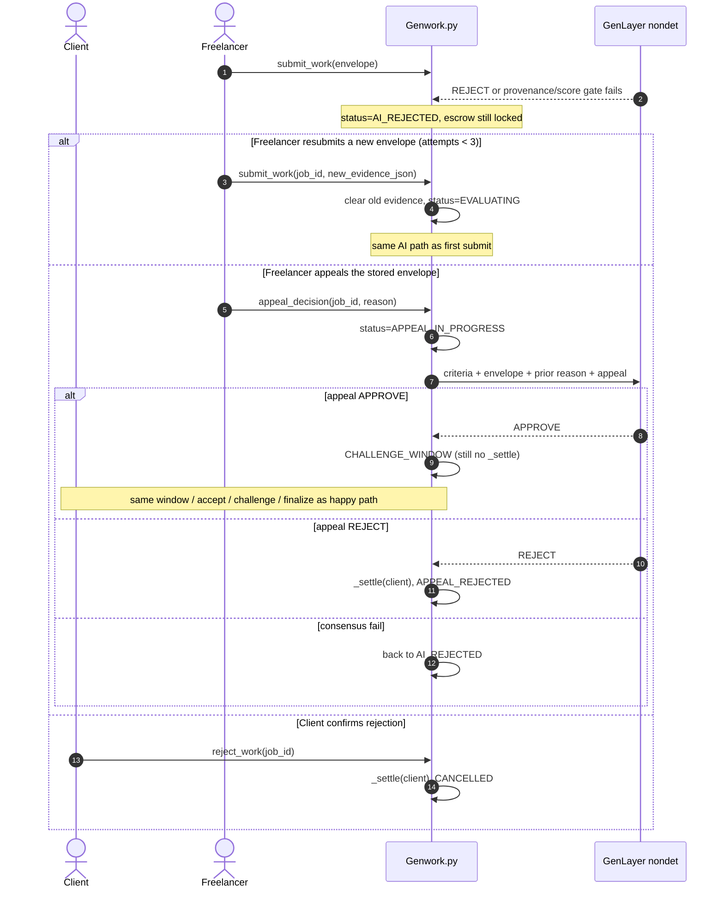

# GenWork Milestone Upgrade: Acceptance Criteria, Authenticated Evidence, and Client Challenge Window

| Field | Value |
|---|---|
| **Document** | Technical Design / Roadmap |
| **Author** | GenWork Lead Architect (Milestone Upgrade) |
| **Date** | 2026-08-27 |
| **Status** | Approved defaults, ready for implementation review |
| **Audience** | Project owner (design review before any implementation) |
| **Scope** | `Genwork.py`, `app/page.tsx`, `app/constants.ts`, steward invariant tests, StudioNet redeploy |
| **Out of scope** | Off-chain backends, Next.js LLM providers, in-place storage migration of the live contract |

---

## Overview

GenWork was accepted by the GenLayer Stewards and awarded 160 points, with a blocking quality gap: **an AI `APPROVE` can release native GEN escrow from freelancer-controlled free text or an arbitrary URL**, without structured acceptance criteria, without proving authorship or deliverable provenance, and without giving the client a chance to contest.

This design maps every sentence of that steward feedback onto concrete Intelligent Contract and frontend changes, while preserving the invariants that previously caused rejection (sender-derived authority, payable native escrow, real `gl.nondet` evaluation, fail-closed `_Wallet.emit_transfer`, no `setInterval` chain polling).

The upgrade has three pillars:

1. **Explicit acceptance criteria** authored by the client at `post_job` time, stored as first-class job state, and used as the scoring rubric for every AI evaluation, appeal, and challenge. The contract, not the prompt, checks that `criteria_results` cover exactly the job’s criterion ids and that `pass is True` (boolean).
2. **Authenticated evidence envelopes** that replace the bare `work_data` string. A submission is a bound JSON payload (`job_id` + criteria hash + content hash + sender attestation). This is **submission provenance** (who attested which bytes for which job at T0), not a cryptographic proof that the sender *authored* a third-party URI. Copied-URL authorship is enforced by the client challenge window plus a stored body snapshot scored at challenge time (v1 does **not** live-re-fetch the freelancer URI). URIs are scheme- and IP-allowlisted; fetched bodies are hashed with a frozen UTF-8 preimage; provenance failure is a mandatory `REJECT`.
3. **A client challenge window** after AI approval. Escrow stays locked. The clock is the submit/appeal **transaction** datetime plus the client-chosen window (minimum **3600s**, because that timestamp includes GenLayer consensus latency). The client may submit authenticated counter-evidence, or `accept_work` early. Only after the window expires unchallenged (via `finalize_payout`) or the client accepts / a challenge is overruled does `_settle` pay the freelancer. UPHOLD settlement failures cannot invert into a freelancer payout.

Redeploy is expected. There is no in-place migration of `0x938E60D0b5466FcB0fA4c7677b7f7D3A3238D2F9`. Jobs on the old address are abandoned.

---

## Steward Feedback Mapping

Verbatim steward text, mapped to the exact code that is wrong today and the change that closes the gap.

| Steward sentence | What the code does today | Contract change | UI change |
|---|---|---|---|
| “This can receive project credit, but an approval can release escrow from freelancer-controlled text or an arbitrary URL without proving authorship or deliverable provenance.” | `submit_work` (`Genwork.py` 103–164) accepts a freeform `work_data` string. If it starts with `http://` or `https://`, `gl.nondet.fetch_url` is used; otherwise raw text is accepted. On `decision == "APPROVE"`, `_settle(job, job["freelancer"])` runs in the same transaction. The sender is stored as `freelancer` but nothing binds the payload to that address, a content hash, or the job’s criteria. | Replace `work_data: str` with an evidence envelope. Validate scheme, **non-IP host**, hash, sender binding, and `job_id`/`criteria_hash` **before** the nondet block. Fetch+hash inside `leader_fn` with a frozen UTF-8 preimage; fail closed on fetch/hash failure. **Remove** `_settle` from the approve branch. Store a 4KiB `body_preview` so later challenge does not depend on a live URI. | Replace the Job Board textarea “Paste Web Link (https://...) OR Type text proof...” (`app/page.tsx` ~1265) with a structured evidence form (type, URI or body, auto-computed SHA-256 of UTF-8 text, exact author-statement template). |
| “For a stronger version, bind each job to explicit acceptance criteria” | `post_job(desc, category)` (`Genwork.py` 75–101) stores only a freeform `desc`. The AI prompt compares evidence solely to `job['desc']` (lines 135–142 and 196–204). | `post_job(desc, category, criteria_json, challenge_window_secs)`. Parse/validate a JSON array of criterion objects, persist it, store `criteria_hash`. `_score_or_reject` requires `set(result ids) == set(job criterion ids)`, `len` equal, no duplicates, and `r.get("pass") is True` (not `bool(pass)`). Prompts still list the criteria, but the gate is deterministic. | Dashboard “Post a New Job” panel (`app/page.tsx` ~1037–1073): add a criteria builder (1–8 rows) and a challenge-window selector (min 1 hour). Job Board cards list criteria as a checklist, not just `job.desc`. |
| “and authenticated evidence” | Evidence is an untyped string. A copied URL, a `javascript:` URI, a 404 page, or a paragraph of unrelated text can all enter evaluation. | Envelope = **submission provenance**: this EOA attested these bytes for this `job_id` + `criteria_hash` at T0. It does **not** prove the sender authored a third-party URI. Copied-URL / fake-authorship residual is closed economically by the challenge window (client counter-envelope scored against `body_preview`; live URI take-down does not skip that eval) plus a 1h minimum so the client can actually see the hold. Deterministic validation of required fields, allowlisted URI schemes, IP rejection, SHA-256 `content_hash`, `attested_by == _get_sender()`. | Client-side envelope builder using Web Crypto SHA-256 over UTF-8 text. `submit_work` sends `JSON.stringify(envelope)`. Resubmit form from `AI_REJECTED` / `FAILED_EVALUATION` so a bad hash is correctable. |
| “then add a client counter-evidence or challenge window before payout.” | Approve path is terminal and pays immediately. No hold status, no deadline, no client contest method, no `finalize_payout`. `appeal_decision` APPROVE also calls `_settle` immediately (lines 214–217). | New statuses `CHALLENGE_WINDOW` and `CHALLENGE_EVALUATING`. Deadline = **submit/appeal tx datetime** + window (clock **includes consensus latency**; min 3600s). `challenge_opened_at` / `challenge_deadline` are write-once. New methods `challenge_work`, `accept_work`, `finalize_payout`. Appeal-approve also enters the window. Nondet exceptions and `_settle` exceptions are **separate try blocks**. `challenge_decision` is `_save_jobs`'d **before** `_settle`. If payout throws, the method still succeeds with durable UPHOLD and `settled is False`; `finalize_payout` pays the client. `_settle` to freelancer is reachable only from accept / finalize / challenge-overrule, and **never** when persisted `challenge_decision == "UPHOLD"`. | Job cards: countdown + deadline, Challenge form (client), Accept-early, Finalize, `CHALLENGE_EVALUATING` waiting panel, `CHALLENGE_UPHELD` terminal panel. |

No sentence of the steward note is left as “documentation only.” Each one changes stored job state, a write method, an AI prompt, and a visible Job Board control.

---

## Background & Motivation

### Current state (cite-the-code)

GenWork is a single Intelligent Contract (`Genwork.py`) plus a single-page Next.js 16 frontend (`app/page.tsx`) talking to StudioNet through `genlayer-js` + wagmi/RainbowKit. Escrow is native GEN: `post_job` is `@gl.public.write.payable` and locks `int(gl.message.value)`. Payout is `_Wallet(dest).emit_transfer(value=u256(wei))` with a fail-closed fallback; there is no `except: pass`.

The live job object (`post_job` lines 87–100) is:

```python
{
    "id", "desc", "price_wei", "category",
    "client", "freelancer", "work_data",
    "status", "ai_decision", "messages",
    "settled", "settled_to",
}
```

Statuses today: `OPEN` → `EVALUATING` → `COMPLETED` (pay freelancer) | `AI_REJECTED` (escrow locked) | `FAILED_EVALUATION` (client may cancel). From `AI_REJECTED`: freelancer `appeal_decision` → `APPEAL_IN_PROGRESS` → `COMPLETED` (pay freelancer) or `APPEAL_REJECTED` (pay client). Client `reject_work` from `AI_REJECTED` refunds. Client `cancel_job` from `OPEN` or `FAILED_EVALUATION` refunds.

The frontend posts with:

```638:654:app/page.tsx
  const handlePostJob = async () => {
    // ...
      const tx = await sendGenLayerTransaction("post_job", [String(jobDesc), String(jobCategory)], priceWei);
```

and submits with:

```671:680:app/page.tsx
  const handleSubmitWork = async (jobId: string) => {
    const workData = workInputs[jobId];
    // FIXED: Now accepts plain text OR links! Removed the strict URL check.
    // ...
      const tx = await sendGenLayerTransaction("submit_work", [String(jobId), String(workData)]);
```

That “FIXED” comment is the steward gap in one line: the product explicitly widened intake to arbitrary text or any URL, then paid on AI approval.

### Pain points

1. **Rubric is prose.** `desc` is marketing copy and scoring rubric at once. The model can “approve” a related-looking blog post against a vague description.
2. **No provenance.** There is no content hash, no sender-bound attestation, no URI allowlist, and a failed fetch still reaches the LLM (`Failed to fetch URL: ...` is stuffed into the prompt rather than hard-failing).
3. **No client agency after approve.** The person who locked GEN never sees a hold. A bad approve is irreversible because `_settle` already ran.
4. **Appeal-approve has the same bug.** `appeal_decision` lines 214–217 also `_settle` to the freelancer on APPROVE. Closing only `submit_work` would leave a second “approval releases escrow” path.

### Why this milestone, not a cosmetic prompt tweak

Stewards already gave project credit. The remaining bar is **binding**: criteria in state, evidence authenticated, payout delayed. Prompt-only changes would not survive a re-read of `submit_work`.

---

## Goals & Non-Goals

### Goals

- Bind every job to 1–8 client-authored acceptance criteria at `post_job` time; persist them; hash them; score every AI path against them with a deterministic id-set and `pass is True` gate.
- Replace bare `work_data` with a versioned evidence envelope that a GenLayer contract can actually enforce with today’s primitives (`gl.message.sender_address`, `hashlib.sha256`, `gl.nondet.fetch_url`, `gl.nondet.exec_prompt`, `gl.vm.run_nondet_unsafe`). Envelope = submission provenance; content authorship of a copied URI is enforced by the challenge window + snapshot.
- After any AI/appeal APPROVE, hold escrow in `CHALLENGE_WINDOW` for a per-job duration whose clock starts at the **submit/appeal transaction timestamp** (includes consensus latency). Minimum window 3600s. Client may challenge with an authenticated counter-envelope or accept early. Permissionless `finalize_payout` after expiry, but never to the freelancer if the **persisted** `challenge_decision == "UPHOLD"` (`_save_jobs` before `_settle`; method still succeeds if pay throws).
- Let the assigned freelancer **resubmit** a new envelope from `AI_REJECTED` and `FAILED_EVALUATION` (max 3 submissions per job). Appeal remains a same-envelope second opinion.
- Preserve: no caller-supplied role addresses, payable native escrow, real nondet AI (not a stub), double-settlement guard, fail-closed native transfer, frontend `parseEther` + `writeContract` `value`, no `setInterval`, no `connect("studionet")`, no `provider: typeof window`.
- Update steward invariant tests rather than freeze them. Redeploy; point `CONTRACT_ADDRESS` at the new deployment.

### Non-Goals

- In-place migration of jobs on `0x938E…D2F9`.
- Off-chain servers, IPFS pinning infrastructure, GitHub OAuth, TLS client certificates.
- Adding an LLM provider to the Next.js app. Evaluation stays on-contract.
- Splitting `app/page.tsx` into a multi-page app or component library. Helpers at module scope are allowed; a rewrite is not.
- Migrating `jobs_data: str` JSON blob to `TreeMap` / `@allow_storage` dataclasses. Size limits on the new fields mitigate blob growth; a storage-layout rewrite is a later milestone.
- On-contract secp256k1 / EIP-191 recovery. GenVM does not ship `eth_account`; the transaction signature already authenticates the sender. See Alternatives.
- Automatic payout via a keeper network. `finalize_payout` is an explicit transaction.

---

## Key Decisions

1. **Criteria are a JSON array on the job, not extra prose in `desc`.** Rationale: the steward asked to *bind* the job to criteria. A concatenated description can be ignored by the model and cannot be validated (count, non-empty statements, evidence type). A parsed array can.

2. **`post_job` grows two string arguments: `criteria_json` and `challenge_window_secs`.** Rationale: the frontend already stringifies every write arg (`sendGenLayerTransaction` maps `args` through `String(...)`). Keep the ABI all-`string` so we do not fight genlayer-js encoding. Parse integers and JSON inside the contract.

3. **Evidence is `genwork.evidence.v1` JSON, still passed as one string.** Rationale: GenLayer public methods in this repo are string-typed; a struct ABI would be a larger platform bet. JSON lets us version the envelope without a new method per field.

4. **Envelope = submission provenance, not content authorship.** `attested_by == _get_sender()` plus `job_id` + `criteria_hash` + `content_hash` proves: this EOA signed a tx containing this JSON, the job/criteria bind, and the bytes fetched at T0 match the hash. It does **not** prove the sender created a third-party URI. A copier who re-attests a public GitHub raw URL still reaches `CHALLENGE_WINDOW`. **Authorship of content is enforced by the client challenge** (counter-envelope + second eval against `body_preview`; v1 does not live-re-fetch the freelancer URI). In-contract ECDSA recovery is not available in the pinned py-genlayer stdlib. Alternative J (no permissionless finalize) would make copied-URL payouts impossible when the client is offline, at the cost of liveness; this milestone keeps finalize and a 1h minimum window instead.

5. **SHA-256 preimage is frozen as UTF-8 text (v1).** Inline: hash `body.encode("utf-8")` deterministically. URI: see “Frozen hash preimage” below. `hashlib.sha256` is used in official GenLayer docs. Binary-only deliverables (PDF/image bytes that are not valid UTF-8) are **out of v1** — `provenance_ok: false`. Frontend hashes `TextEncoder` of the text the freelancer believes validators will see (GitHub raw, gist, IPFS decoded as UTF-8), and displays the hex they are binding.

6. **URI allowlist: `https:` and `ipfs:` only. Reject `http:`, `javascript:`, `data:`, `file:`, empty host, localhost, `.local`, userinfo, and any host that parses as IPv4/IPv6/dword/octal/hex IP — not merely “must contain a dot” (IPv4 contains dots).** Rationale: this is the “arbitrary URL” half of the steward note. IPFS is rewritten to `https://ipfs.io/ipfs/<cid>` inside the nondet block. Gateway 5xx/HTML error pages hash-disagree and fail closed; no retry inside `leader_fn`. Residual: public-host SSRF and HTTP redirects to metadata if `fetch_url` follows them (cannot disable from contract; treat unexpected body as HASH_MISMATCH).

7. **AI `APPROVE` never calls `_settle`. Status becomes `CHALLENGE_WINDOW`.** Rationale: this is the payout-timing half of the steward note. The same rule applies to `appeal_decision` APPROVE, otherwise the gap moves to the appeal path.

8. **Time source is the GenVM transaction datetime, not a block number and not host wall-clock. The window clock includes consensus latency.** Official docs (`https://docs.genlayer.com/developers/intelligent-contracts/features/transaction-context`) state there is **no block number / block hash**, and that `datetime.now()` / `time.time()` are pinned to the transaction timestamp. `_now_ts()` called at the **end** of `submit_work` after the LLM still returns the **same** tx datetime — capturing later in the method does not skip consensus. Deadline = `submit_or_appeal_tx_timestamp + window_secs`, which can be minutes or hours behind wall-clock when `CHALLENGE_WINDOW` first becomes readable. Later txs compare *their* tx timestamps to that deadline (validators agree). Residual: StudioNet timestamp quality vs UI `Date.now()`.

9. **Per-job window, client-set at `post_job`, bounds 3600s–604800s, UI default 86400s. No 300s option.** Rationale: GenLayer nondet consensus is typically minutes; a 5-minute window can be **dead on arrival** when the Job Board first shows the hold. 3600s is `>>` expected StudioNet submit-work finality so the client still has a challenge. Default 24h is production-like. Cap 7d. Smoke tests must not use a window shorter than observed submit-work finality (never < 3600s). `challenge_opened_at` / `challenge_deadline` are **write-once** (first enter from approve/appeal). Failed challenge retries must not call `apply_approval_window`.

10. **Three new write methods: `challenge_work`, `accept_work`, `finalize_payout`. No caller-supplied addresses.** Rationale: challenge is client-only and window-gated; accept is client-only early exit; finalize is permissionless after expiry so payout cannot stick if the freelancer is offline. All three derive identity from `_get_sender()`. Finalize pays the freelancer **only if** `challenge_decision` is empty (or `OVERRULE` with a failed prior `_settle`). If `challenge_decision == "UPHOLD"`, the only legal `_settle` recipient is `job["client"]`. Alternative J (client-gated, no finalize) is rejected for liveness; see Alternatives.

11. **Persist `challenge_decision` with `_save_jobs` before `_settle`. If payout throws, the method must still succeed.** In-memory `job["challenge_decision"] = "UPHOLD"` is not storage. Today’s contract only persists at `_save_jobs` (`Genwork.py` 40–41, 121, 164). If `_settle` is left uncaught, both realistic GenVM outcomes invert a client-win into a freelancer payout after expiry: (a) the whole method reverts, decision never existed; (b) only the pre-nondet `CHALLENGE_EVALUATING` save survives, decision still empty, escape hatch pays freelancer. Required shape: write decision → `_save_jobs` → `try: _settle` → `except: do not clear decision, do not restore CHALLENGE_WINDOW, do not re-raise`. Terminal status is set even when `settled is False`. `finalize_payout` then pays the client because the **durable** field is `UPHOLD`. Same persist-then-pay for OVERRULE (finalize pays freelancer, no expiry wait). Consensus `try/except` wraps only `run_nondet_unsafe` and **must not** catch the settlement `try`. Cap `challenge_attempts` at 3 **applied** results (see KD 16). Empty durable decision after expiry still pays freelancer.

12. **Stay in `app/page.tsx`; add module-scope helpers; no `setInterval`.** Rationale: this is a single-page app. Steward tests assert `setInterval` is absent (`tests/test_steward_invariants.py` line 94). Countdown is render-time `Date.now()` against the stored deadline, plus the existing Refresh button. Optional `requestAnimationFrame` is already used by `AnimatedBackground` if a live tick is wanted later; v1 does not add it.

13. **Update the invariant tests in the same milestone. Do not freeze the 7-method list or the 2-arg `post_job`.** Rationale: the tests currently hardcode the old ABI and the old fund-conservation table. Shipping the upgrade while leaving those assertions would make CI lie.

14. **Redeploy. Old StudioNet jobs are abandoned.** Rationale: `jobs_data` is an opaque JSON string with no schema version. Rewriting live rows in `__init__` is impossible after deploy. Testnet discard is acceptable.

15. **Assigned freelancer may `submit_work` again from `AI_REJECTED` and `FAILED_EVALUATION` with a new envelope (max 3 submissions).** Rationale: hash mismatch, disallowed scheme, and failed criteria become common hard rejects. Appeal still re-scores the **stored** envelope (same-evidence second opinion). Without resubmit, a typo’d hash is a dead job. First submit still assigns `freelancer` from `OPEN`; later submits must be that same address. Client `reject_work` remains available on `AI_REJECTED` (race: first mined tx wins).

16. **Challenge scoring uses `body_preview` only. v1 does not live-re-fetch the freelancer URI.** Store `body_preview` (first 4096 UTF-8 chars) and `evidence_content_hash` at submit. `challenge_work`’s `leader_fn` scores **snapshot + client counter-envelope** (fetch the **client** URI if the counter-evidence is not inline; **never** `fetch_url` the original freelancer URI). A live mutation detector on the same `run_nondet_unsafe` would make independent 404/HTML/IPFS-5xx disagreements fail consensus, burn `challenge_attempts`, and skip the snapshot eval — after three flakes the client is locked out and expiry pays the freelancer. Taking the URI down is therefore **not** a freelancer winning strategy (the snapshot remains) and **not** an automatic UPHOLD (the client must still win on the snapshot + counter-evidence). `challenge_attempts` increments only when a result is **applied** (UPHOLD, OVERRULE, or discarded-after-LLM). Consensus-fail restore to `CHALLENGE_WINDOW` leaves the counter unchanged. Full-file replay is limited to 4KiB.

17. **Deterministic helpers are top-level functions in `Genwork.py` (no `gl.*`) and are unit-tested without GenVM in this milestone.** `_settle` appears **zero** times in the `submit_work` method body. Appeal APPROVE must not `_settle` the freelancer. Window math greps are tripwires; helper unit tests actually execute `uri_allowed` / `host_is_ip` / `parse_criteria` / `validate_envelope` / `window_expired` / `score_or_reject` / `utf8_digest`. Direct Mode `vm.warp()` remains a residual steward risk (SDK not in the repo).

18. **Feature branch until PR 5 is mandatory. No StudioNet deploy and no `CONTRACT_ADDRESS` change until PR 3 and PR 4 are in the same bytecode.** Rationale: merging PR 1 to demo `main` breaks the live 2-arg contract; deploying PR 3 without `challenge_work` leaves a client who disagrees with AI approve no refund path. Effort: ~6–8 engineering days across five PRs on one SPA file plus the contract.

---

## Proposed Design

### Architecture (after upgrade)



### State machine

New statuses in **bold**. `COMPLETED` now means “freelancer was paid,” never “AI liked it.”

```mermaid
stateDiagram-v2
    [*] --> OPEN: post_job (locks msg.value)

    OPEN --> CANCELLED: cancel_job / client
    OPEN --> EVALUATING: submit_work / not client,\nenvelope valid (assigns freelancer)

    EVALUATING --> CHALLENGE_WINDOW: AI APPROVE\n(no _settle; write-once deadline)
    EVALUATING --> AI_REJECTED: AI REJECT
    EVALUATING --> FAILED_EVALUATION: nondet exception

    FAILED_EVALUATION --> CANCELLED: cancel_job / client
    FAILED_EVALUATION --> EVALUATING: submit_work / assigned freelancer,\nnew envelope, attempts < 3

    AI_REJECTED --> APPEAL_IN_PROGRESS: appeal_decision / freelancer\n(same envelope)
    AI_REJECTED --> EVALUATING: submit_work / assigned freelancer,\nnew envelope, attempts < 3
    AI_REJECTED --> CANCELLED: reject_work / client

    APPEAL_IN_PROGRESS --> CHALLENGE_WINDOW: appeal APPROVE\n(no _settle)
    APPEAL_IN_PROGRESS --> APPEAL_REJECTED: appeal REJECT\n(_settle client)
    APPEAL_IN_PROGRESS --> AI_REJECTED: appeal consensus fail

    CHALLENGE_WINDOW --> COMPLETED: accept_work / client\n(_settle freelancer)
    CHALLENGE_WINDOW --> COMPLETED: finalize_payout / anyone\nafter deadline, decision empty\n(_settle freelancer)
    CHALLENGE_WINDOW --> CHALLENGE_EVALUATING: challenge_work / client\nbefore deadline, attempts < 3
    CHALLENGE_WINDOW --> CHALLENGE_UPHELD: finalize_payout if decision=UPHOLD\nand not settled (_settle client)

    CHALLENGE_EVALUATING --> COMPLETED: OVERRULE\n(_save_jobs decision then _settle freelancer)
    CHALLENGE_EVALUATING --> CHALLENGE_UPHELD: UPHOLD\n(_save_jobs decision then try _settle client;\nmethod succeeds even if pay throws)
    CHALLENGE_EVALUATING --> CHALLENGE_WINDOW: consensus fail\n(retry; attempts NOT incremented;\ndeadline NOT reset)
    CHALLENGE_EVALUATING --> COMPLETED: finalize_payout after deadline\nif decision empty (_settle freelancer)

    CANCELLED --> [*]
    COMPLETED --> [*]
    APPEAL_REJECTED --> [*]
    CHALLENGE_UPHELD --> [*]
```

**Hard rules**

- `_settle` is the only payout. `job["settled"]` remains the double-pay guard.
- `EVALUATING` / `APPEAL_IN_PROGRESS` never transfer. `CHALLENGE_EVALUATING` may transfer only **after** a durable `_save_jobs` of `challenge_decision`. If that `_settle` throws, the method still returns; `settled` stays false; `finalize_payout` finishes the pay.
- `CHALLENGE_WINDOW` never transfers inside `challenge_work` / `submit_work`. Payout from this status is only `accept_work` (client, freelancer) or `finalize_payout` (destination keyed by the **persisted** `challenge_decision`).
- Durable UPHOLD with `settled is False` is a legal parked state. It is **not** an empty-decision escape hatch. `finalize_payout` must inspect `challenge_decision` **before** status/expiry.
- Client **cannot** `cancel_job` from `CHALLENGE_WINDOW` or `CHALLENGE_EVALUATING` (grief refund after a valid AI approve). Remedy is `challenge_work` or doing nothing.
- Client **cannot** `reject_work` from `CHALLENGE_WINDOW`. `reject_work` stays `AI_REJECTED`-only.
- `challenge_opened_at` / `challenge_deadline` are write-once. Restoring `CHALLENGE_WINDOW` after a failed challenge must not assign them.
- If `challenge_decision == "UPHOLD"`, every subsequent `_settle` recipient is `job["client"]`. `finalize_payout` must implement this, not only `challenge_work`.
- `send_message` is allowed in every status including `CHALLENGE_WINDOW` / `CHALLENGE_EVALUATING` / `CHALLENGE_UPHELD` (discussion stays on).

### Sequence 1 — Happy path

```mermaid
sequenceDiagram
    autonumber
    actor Client
    actor Freelancer
    participant UI as page.tsx
    participant IC as Genwork.py
    participant AI as GenLayer nondet

    Client->>UI: criteria[1..8], window, desc, category, GEN
    UI->>IC: post_job(desc, category, criteria_json, window_secs) value=priceWei
    IC->>IC: validate criteria, hash, lock int(gl.message.value)
    Note over IC: status=OPEN, settled=false

    Freelancer->>UI: evidence type, URI or body
    UI->>UI: sha256(body), attested_by=address, criteria_hash
    UI->>IC: submit_work(job_id, evidence_json)
    IC->>IC: envelope checks (deterministic)
    IC->>IC: status=EVALUATING, freelancer=sender, store body_preview
    IC->>AI: fetch_url if URI, UTF-8 hash check, per-criterion prompt
    AI-->>IC: APPROVE + provenance_ok is True + exact criterion ids
    IC->>IC: write-once deadline = tx_ts + window (includes consensus latency)
    Note over IC: status=CHALLENGE_WINDOW, NO emit_transfer

    Note over Client,IC: window elapses (no challenge; min 3600s)

    Freelancer->>IC: finalize_payout(job_id)
    IC->>IC: now >= deadline, decision empty, not settled
    IC->>IC: _settle(freelancer)
    Note over IC: status=COMPLETED, settled=true
```

### Sequence 2 — Challenge path

```mermaid
sequenceDiagram
    autonumber
    actor Client
    actor Freelancer
    participant IC as Genwork.py
    participant AI as GenLayer nondet

    Note over IC: status=CHALLENGE_WINDOW, escrow locked

    Client->>IC: challenge_work(job_id, counter_evidence_json)
    IC->>IC: sender==client, now < deadline, attempts<3, envelope valid
    IC->>IC: status=CHALLENGE_EVALUATING (deadline unchanged, attempts NOT yet++)
    Note over IC: leader_fn MUST NOT fetch_url the freelancer URI
    IC->>AI: criteria + body_preview + client counter body
    alt UPHOLD and score gate passes
        AI-->>IC: decision=UPHOLD, provenance_ok is True, ids match
        IC->>IC: challenge_decision=UPHOLD; _save_jobs; attempts++
        IC->>IC: try _settle(client); catch pay fail (do not revert decision)
        IC->>IC: status=CHALLENGE_UPHELD (settled true or false)
        Note over IC: if settled false, anyone finalize_payout pays client
    else OVERRULE and all criteria still pass
        AI-->>IC: decision=OVERRULE
        IC->>IC: challenge_decision=OVERRULE; _save_jobs; attempts++
        IC->>IC: try _settle(freelancer); catch pay fail (do not revert decision)
        IC->>IC: COMPLETED if paid, else parked with durable OVERRULE
    else consensus exception
        IC->>IC: status=CHALLENGE_WINDOW (attempts unchanged)
        Note over IC: deadline NOT reset; retry if now < deadline
    else provenance_ok is not True OR ids mismatch
        IC->>IC: status=CHALLENGE_WINDOW, attempts++ (applied discard)
        Note over IC: deadline NOT reset
    end
```

### Sequence 3 — Rejection / appeal (kept compatible, approve delayed)



---

## Data Model Changes

Storage layout is unchanged at the contract field level: `jobs_data: str` and `profiles_data: str`. The job **object** inside `jobs_data` grows. There is no migration. After redeploy `__init__` writes `"[]"`.

### Job object (after)

```python
{
    # existing
    "id": "1",
    "desc": str,
    "price_wei": str,
    "category": str,
    "client": str,          # lowercased sender at post_job
    "freelancer": str,      # lowercased sender at submit_work, else ""
    "work_data": str,       # RETAINED: canonical JSON of the freelancer envelope (audit + get_all_jobs)
    "status": str,
    "ai_decision": str,
    "messages": list,
    "settled": bool,
    "settled_to": str,

    # new — criteria
    "criteria": [           # parsed array, not a string of prose
        {
            "id": "c1",
            "statement": "README includes install, run, and test commands.",
            "evidence_type": "https_document",  # inline_text | https_document | ipfs_cid | any
        }
    ],
    "criteria_hash": "sha256:<64 hex>",  # of canonical criteria JSON

    # new — window
    "challenge_window_secs": "86400",
    "challenge_opened_at": "",     # Unix seconds, set on first APPROVE
    "challenge_deadline": "",      # opened_at + window_secs
    "challenge_tx_datetime": "",   # ISO from gl.message_raw['datetime'] for audit

    # new — evidence
    "evidence": {},                # parsed freelancer envelope
    "evidence_content_hash": "",   # sha256:hex of UTF-8 preimage at T0
    "body_preview": "",            # first 4096 UTF-8 chars of fetched/inline body
    "ai_criteria_results": [],     # [{id, pass, reason}, ...] from last eval
    "submission_count": "0",       # increment on each submit_work; max 3

    # new — challenge
    "counter_evidence": {},
    "counter_body_preview": "",
    "challenge_decision": "",      # UPHOLD | OVERRULE | ""  write-once, persisted via _save_jobs BEFORE _settle
    "challenge_reason": "",
    "challenge_attempts": "0",     # increment only when a result is applied (not on consensus fail); max 3
}
```

`work_data` is kept as the raw envelope JSON so existing UI that renders `job.work_data` does not explode before the new renderer lands, and so search (`visibleJobs` filters on `work_data`) still works.

### Criteria JSON (client → `post_job`)

```json
[
  {
    "id": "c1",
    "statement": "Public Git repo contains a working Next.js app that builds.",
    "evidence_type": "https_document"
  },
  {
    "id": "c2",
    "statement": "README documents install, run, and test in under 20 lines.",
    "evidence_type": "any"
  }
]
```

**Validation (`_parse_criteria` / `_validate_criteria`)** — deterministic, raises, no AI:

| Rule | Bound |
|---|---|
| Type | JSON array |
| Count | 1–8 inclusive |
| `id` | non-empty, unique within the job, `[a-zA-Z0-9_-]{1,32}` |
| `statement` | stripped length 10–500 |
| `evidence_type` | exactly one of `inline_text`, `https_document`, `ipfs_cid`, `any` |
| Payload size | `len(criteria_json) <= 4096` |
| No extra required keys | unknown keys ignored (forward compatible) |

Empty `desc` is rejected (`len(str(desc).strip()) >= 10`) so the Job Board title remains usable. **This is a behavior change**: today’s `post_job` does not check `desc` length; the UI only checks non-empty. Criteria do not replace `desc`; they bind it.

**v1 limitation — one envelope for all criteria:** if **any** criterion has `evidence_type` in `{https_document, ipfs_cid}`, the single envelope must be fetchable. A job that mixes “paste the copy” (`inline_text`) with “link the deployed app” (`https_document`) cannot be satisfied by inline-only. Clients who need both should put the URL in the hosted document or split into two jobs. Document this on the criteria builder.

**Canonical hash**

```python
def _canonical_dumps(obj) -> str:
    return json.dumps(obj, sort_keys=True, separators=(",", ":"), ensure_ascii=False)

def _sha256_hex(s: str) -> str:
    import hashlib
    return hashlib.sha256(s.encode("utf-8")).hexdigest()

def _criteria_hash(criteria: list) -> str:
    return "sha256:" + _sha256_hex(_canonical_dumps(criteria))
```

Frontend must hash with the same canonicalization when filling `criteria_hash` on the envelope (or simply copy `job.criteria_hash` from `get_all_jobs` — preferred, so the freelancer cannot “hash a different array”).

### Evidence envelope `genwork.evidence.v1`

```json
{
  "schema": "genwork.evidence.v1",
  "evidence_type": "https_document",
  "uri": "https://raw.githubusercontent.com/org/repo/main/deliverable.md",
  "body": "",
  "content_hash": "sha256:e3b0c44298fc1c149afbf4c8996fb92427ae41e4649b934ca495991b7852b855",
  "author_statement": "I produced this deliverable for GenWork job 3 against criteria sha256:…",
  "attested_by": "0xabc…",
  "job_id": "3",
  "criteria_hash": "sha256:…",
  "role": "freelancer_submission"
}
```

| Field | Required | Notes |
|---|---|---|
| `schema` | yes | must equal `genwork.evidence.v1` |
| `evidence_type` | yes | `inline_text` \| `https_document` \| `ipfs_cid` |
| `uri` | if not inline | see allowlist |
| `body` | if inline | UTF-8 text, 1–4096 chars; empty for URI types |
| `content_hash` | yes | `sha256:` + 64 lowercase hex |
| `author_statement` | yes | **exact** template (no substring check — job `"1"` would match any sentence containing the digit `1`): freelancer `I produced this deliverable for GenWork job {job_id} against criteria {criteria_hash}.` ; client `I challenge GenWork job {job_id} against criteria {criteria_hash}.` |
| `attested_by` | yes | lowercase hex address, **must equal** `_get_sender()` |
| `job_id` | yes | must equal the method’s `job_id` |
| `criteria_hash` | yes | must equal `job["criteria_hash"]` |
| `role` | yes | `freelancer_submission` on submit; `client_challenge` on challenge |

**Size:** `len(evidence_json) <= 8192`.

**URI allowlist (`uri_allowed` — top-level, unit-tested)**

Parse with `urllib.parse.urlparse`. Reject on any failure.

- Scheme ∈ `{https, ipfs}` only (lowercased). Reject `javascript:`, `data:`, `file:`, `blob:`, `ftp:`, `http:` (not even for demos).
- Reject userinfo (`@` / `parsed.username` or `parsed.password`).
- `https` host (`parsed.hostname`, lowercased, strip trailing dot):
  - Reject empty host, `localhost`, any host ending in `.local` or `.localhost`.
  - Reject if `host_is_ip(host)` is true (see below). IPv4 **contains dots**, so “host must contain a dot” is **not** an IP check.
  - Host must contain at least one letter `a-z` (blocks dotted-decimal, dword, and most hex/octal IP forms) **and** at least one `.` (blocks single-label hosts).
- `ipfs`: `ipfs://<cid>` or `ipfs://<cid>/path`. CID `^[a-zA-Z0-9]{46,90}$` (CIDv0 `Qm…` or CIDv1 `bafy…`). Inside `leader_fn` rewrite to `https://ipfs.io/ipfs/<cid>[/path]`. Single gateway. **Gateway 5xx or HTML error pages will hash-disagree across validators and fail closed (`FETCH_FAILED` / `HASH_MISMATCH`). No retry inside `leader_fn`.**
- Redirects: `gl.nondet.fetch_url` redirect policy is not exposed. Residual: an allowlisted host that 302s to metadata/loopback is public-host SSRF inherent to `fetch_url`. The hash of that unexpected body will not match `content_hash` → `HASH_MISMATCH` at **submit** time (fail closed). Challenge does not re-fetch the freelancer URI, so a later redirect change is irrelevant. Do not claim redirects are disabled unless Studio documents that.

**`host_is_ip(host) -> bool` (must reject these, unit-tested):**

```python
def host_is_ip(host: str) -> bool:
    h = host.strip("[]").lower().rstrip(".")
    if ":" in h:  # IPv6 or :port mistaken as host
        return True
    labels = h.split(".")
    # dotted decimal IPv4 (incl. 169.254.169.254, 10.0.0.1, 127.0.0.1)
    if len(labels) == 4 and all(p.isdigit() and 0 <= int(p, 10) <= 255 and str(int(p, 10)) == p for p in labels):
        return True
    # octal-ish IPv4 0177.0.0.1
    if len(labels) == 4 and all(p.isdigit() and 0 <= int(p, 8) <= 255 for p in labels if p.isdigit()):
        if any(p.startswith("0") and len(p) > 1 for p in labels):
            return True
    # hex labels 0x7f.0.0.1
    if len(labels) == 4 and all(p.startswith("0x") and all(c in "0123456789abcdef" for c in p[2:]) for p in labels):
        return True
    # dword 2130706433
    if h.isdigit() and 0 <= int(h) <= 0xFFFFFFFF:
        return True
    if h.startswith("0x") and all(c in "0123456789abcdef" for c in h[2:]):
        return True
    return False
```

Honesty remains: validators will still fetch any **public DNS name** the freelancer hosts. That is inherent to `fetch_url`. The IP denylist is only for literal IP hosts.

**Compatibility with criterion `evidence_type`**

- If **any** criterion has `evidence_type` in `{https_document, ipfs_cid}`, the envelope type must be fetchable (`https_document` or `ipfs_cid`). An all-inline envelope against a “link to the deployed app” criterion is a deterministic reject.
- If every criterion is `inline_text` or `any`, inline is allowed.
- `any` never forces a type.

**Inline hash (deterministic, before nondet)**

```python
expected = "sha256:" + _sha256_hex(envelope["body"])
if envelope["content_hash"] != expected:
    raise Exception("Inline content_hash does not match body")
```

**Frozen hash preimage (v1, UTF-8 text only)** — used by inline, URI, snapshot, and frontend. Tests must grep this comment next to `sha256_hex`:

```
# HASH_PREIMAGE_V1: SHA-256 of UTF-8 bytes of the text body.
# str  -> encode utf-8 (strict)
# bytes/bytearray -> decode utf-8 (strict) then encode utf-8 (same bytes if well-formed)
# any other type or UnicodeDecodeError/UnicodeEncodeError -> provenance_ok False (binary not in v1)
```

```python
def utf8_digest(raw) -> str:
    if isinstance(raw, str):
        data = raw.encode("utf-8")
    elif isinstance(raw, (bytes, bytearray)):
        raw.decode("utf-8")  # reject binary
        data = bytes(raw)
    else:
        raise ValueError("unhashable fetch type")
    return "sha256:" + hashlib.sha256(data).hexdigest()
```

**URI hash (inside `leader_fn` only)**

```python
raw = gl.nondet.fetch_url(fetch_url)  # keep this primitive; tests count it
if raw is None or (isinstance(raw, str) and not str(raw).strip()):
    return {"decision": "REJECT", "provenance_ok": False, "reason": "FETCH_FAILED"}
try:
    digest = utf8_digest(raw)
except Exception:
    return {"decision": "REJECT", "provenance_ok": False, "reason": "BINARY_OR_BAD_TYPE"}
if digest != envelope["content_hash"]:
    return {"decision": "REJECT", "provenance_ok": False, "reason": "HASH_MISMATCH"}
preview = (raw if isinstance(raw, str) else raw.decode("utf-8"))[:4096]
# leader returns preview + digest; contract stores body_preview on success
```

Frontend: hash `new TextEncoder().encode(text)` of the **text file** the freelancer hosted (GitHub raw / gist / IPFS decoded as UTF-8), never an `ArrayBuffer` of gzip/HTML chrome. Show the hex in the form so they know what they are binding. CORS `fetch` is convenience only; pasted hex is the source of truth if CORS fails.

Do not skip the hash because the page “looked right.”

**What GenLayer cannot do (honesty box)**

| Desired check | Primitive available? | What we do instead |
|---|---|---|
| TLS client certificates | No | https allowlist only |
| GitHub OAuth / “this commit is mine” | No | Freelancer attests via tx sender; optional Git SHA *inside* the statement is advisory for the LLM, not enforced |
| EIP-191 `personal_sign` recover | Not in py-genlayer stdlib | Tx signature *is* the signature; `attested_by == sender` |
| Bit-identical fetch of a dynamic HTML page across validators | No — independent `fetch_url` | Recommend IPFS CID or raw static files; hash mismatch → REJECT / FAILED_EVALUATION |
| Host wall-clock “is it 5pm?” | No — tx datetime only | Window math is relative to submit/appeal-tx timestamp vs later-tx timestamp. That start time **includes consensus latency**. |
| Block-number windows | **No block number in context** | Unix-second windows |
| Bit-identical authorship of a third-party URI | No | Submission provenance + challenge window + snapshot scoring (no live freelancer re-fetch in v1) |

### Challenge window fields

Set **only once**, when first entering `CHALLENGE_WINDOW` from `submit_work` or `appeal_decision`. `_apply_approval_window` must no-op (or raise) if `job["challenge_deadline"]` is already non-empty. Failed `challenge_work` retries restore `status` and `challenge_reason` only.

```python
def apply_approval_window(job: dict) -> None:
    if str(job.get("challenge_deadline") or ""):
        job["status"] = "CHALLENGE_WINDOW"
        return  # write-once
    now = int(datetime.now(timezone.utc).timestamp())  # == this tx's datetime, even after the LLM
    job["challenge_opened_at"] = str(now)
    job["challenge_deadline"] = str(now + int(job["challenge_window_secs"]))
    try:
        job["challenge_tx_datetime"] = str(gl.message_raw["datetime"])
    except Exception:
        job["challenge_tx_datetime"] = ""  # audit-only; _now_ts is source of truth
    job["status"] = "CHALLENGE_WINDOW"
    # explicitly do not call _settle
```

**Window bounds**

| | Seconds | Why |
|---|---|---|
| Minimum | **3600 (1 h)** | `>>` expected StudioNet nondet latency. The deadline is `submit_tx_timestamp + window`, and that timestamp can be minutes (docs: “hours”) old when the hold is first readable. 300s can be dead on arrival. |
| Default (UI) | 86400 (24 h) | Official docs’ 24h expiry example; production-like |
| Maximum | 604800 (7 d) | Caps capital lockup |

Post-Job helper text (required): “The challenge window starts at the timestamp of the submit/appeal transaction, which includes AI consensus time (often several minutes). Minimum 1 hour so the hold is still open when it first appears on the Job Board.”

Smoke tests must use a window **≥ max(3600, observed submit-work finality)**. Never 300s.

Residual risk after this change: a StudioNet outage that delays consensus **past 1 hour** can still present a hold that is already expired. Default 24h covers that; 1h is the floor for demos, not a claim that latency is always < 1h.

---

## API / Interface Changes

All new/changed write methods take **only `str` arguments**. No `client` / `freelancer` / `recipient` / `address` parameters. Identity is `_get_sender()`.

### Frozen raise strings (tests grep these exact bytes)

| Constant | String |
|---|---|
| criteria missing/invalid | `Acceptance criteria required` |
| window bounds | `challenge_window_secs out of bounds` |
| desc too short | `Job description must be at least 10 characters` |
| envelope missing | `Evidence envelope required` |
| schema | `Invalid evidence schema` |
| attested_by | `attested_by does not match sender` |
| inline hash | `Inline content_hash does not match body` |
| URI | `URI scheme not allowed` |
| author statement | `author_statement does not match template` |
| submit status | `Job is not open for submission` |
| resubmit cap | `Resubmit limit reached` |
| challenge caller | `Only the client can challenge` |
| challenge status | `Job is not in challenge window` |
| challenge expired | `Challenge window expired` |
| challenge attempts | `Challenge retry limit reached` |
| challenge decided | `Challenge evaluation already decided` |
| accept caller | `Only the client can accept` |
| accept status | `Job is not in challenge window` |
| finalize early | `Challenge window still open` |
| finalize not opened | `Challenge window not opened` |
| already settled | `Job already settled` (existing) |

### Method catalog

| Method | Decorator | Args | Caller | Allowed status | Settlement |
|---|---|---|---|---|---|
| `post_job` | `write.payable` | `desc, category, criteria_json, challenge_window_secs` | any | n/a (creates OPEN) | none (locks `msg.value`) |
| `submit_work` | `write` | `job_id, evidence_json` | first: not the client; resubmit: assigned freelancer | `OPEN`; or `AI_REJECTED` / `FAILED_EVALUATION` with `submission_count < 3` | **none** (was: freelancer on APPROVE). Zero `_settle` calls in this method body. |
| `appeal_decision` | `write` | `job_id, appeal_reason` | assigned freelancer | AI_REJECTED | **client on REJECT**; **none on APPROVE** (was: freelancer on APPROVE) |
| `reject_work` | `write` | `job_id` | client | AI_REJECTED | client |
| `cancel_job` | `write` | `job_id` | client | OPEN, FAILED_EVALUATION | client |
| `challenge_work` | `write` | `job_id, counter_evidence_json` | client | CHALLENGE_WINDOW, `now < deadline`, `challenge_attempts < 3`, `challenge_decision == ""` | freelancer on durable OVERRULE; client on durable UPHOLD; none on consensus fail (attempts unchanged). `_settle` throw does not revert the decision. |
| `accept_work` | `write` | `job_id` | client | CHALLENGE_WINDOW, `challenge_decision == ""` | freelancer |
| `finalize_payout` | `write` | `job_id` | **anyone** | see spec below | destination keyed by `challenge_decision` |
| `send_message` | `write` | `job_id, message` | any | **any status, including the new ones** | none |
| `update_profile` | `write` | `nickname, avatar_url` | any | n/a | none |
| `get_all_jobs` / `get_profiles` | `view` | none | any | n/a | none |

Write-method count: **7 → 10**. Steward tests that `findall` seven names must be updated.

### Constants

```python
MIN_WINDOW = 3600
MAX_WINDOW = 604800
DEFAULT_WINDOW = 86400
MAX_SUBMISSIONS = 3
MAX_CHALLENGE_ATTEMPTS = 3
BODY_PREVIEW_CHARS = 4096
```

Helpers `uri_allowed`, `host_is_ip`, `parse_criteria`, `validate_envelope`, `window_expired`, `score_or_reject`, `utf8_digest`, `canonical_dumps`, `sha256_hex` are **top-level functions** in `Genwork.py` above `class GenWork`. They must not reference `gl`. Unittest loads them via a `genlayer` stub (`tests/genlayer_stub.py` + `importlib`).

### `submit_work` (full guards)

1. `freelancer = _get_sender()`.
2. Load job. If `status == "OPEN"`: reject if `freelancer == job["client"]` (`Client cannot submit work on their own job`, existing). Assign `job["freelancer"] = freelancer`. If `status in ("AI_REJECTED", "FAILED_EVALUATION")`: reject if `freelancer != job["freelancer"]`; reject if `int(job["submission_count"]) >= 3` (`Resubmit limit reached`); clear `evidence`, `work_data`, `body_preview`, `ai_decision`, `ai_criteria_results` (keep `freelancer`). Else raise `Job is not open for submission`.
3. Parse/validate envelope with `role="freelancer_submission"`. Raises use the frozen strings.
4. `job["submission_count"] = str(int(job.get("submission_count") or "0") + 1)`.
5. Persist `EVALUATING` + envelope + `work_data` (same tx; overwritten on success — matches today’s persist-then-nondet pattern at `Genwork.py` 117–121).
6. Nondet `try`: fetch+hash; `score_or_reject`. On APPROVE: `apply_approval_window` (no `_settle`). On REJECT: `AI_REJECTED`. `except`: `FAILED_EVALUATION`.
7. **This method body contains zero `_settle` calls.**

### `submit_work` approve branch (the actual bug fix)

Today (`Genwork.py` 150–154):

```python
if result.get("decision") == "APPROVE":
    self._settle(job, job["freelancer"])
    job["status"] = "COMPLETED"
```

Target:

```python
outcome, crit_results = score_or_reject(result, job)
job["ai_criteria_results"] = crit_results
if outcome == "APPROVE":
    apply_approval_window(job)  # CHALLENGE_WINDOW, write-once timestamps, NO _settle
    job["ai_decision"] = str(result.get("reason") or "Approved; challenge window open.")
else:
    job["status"] = "AI_REJECTED"
    job["ai_decision"] = str(result.get("reason") or "Rejected.")
```

### `score_or_reject(result, job) -> tuple[str, list]` (deterministic)

```python
def score_or_reject(result, job):
    if not isinstance(result, dict):
        return "REJECT", []
    provenance_ok = result.get("provenance_ok") is True
    decision = str(result.get("decision") or "")
    crit_results = result.get("criteria_results")
    if not isinstance(crit_results, list):
        return "REJECT", []
    expected = [str(c["id"]) for c in job["criteria"]]
    got = [str(r.get("id")) for r in crit_results]
    if len(got) != len(expected) or set(got) != set(expected) or len(got) != len(set(got)):
        return "REJECT", crit_results
    all_pass = all(r.get("pass") is True for r in crit_results)  # NOT bool(r.get("pass"))
    if decision == "APPROVE" and provenance_ok and all_pass:
        return "APPROVE", crit_results
    return "REJECT", crit_results
```

Invariant tests must grep `r.get("pass") is True` and `set(got) != set(expected)` (or equivalent `set(ids) == set(...)` with a length check). Prompt text is not the gate.

### `commit_verdict_then_pay` (required helper — UPHOLD and OVERRULE)

This is the Issue 1 fix. In-memory assignment is not durable. `_save_jobs` is the only persist (`Genwork.py` 40–41). The write method **must return normally** after a payout failure so that save commits.

```python
def commit_verdict_then_pay(self, jobs, idx, job, decision, recipient, terminal_status) -> None:
    # 1. Durable verdict FIRST. Grep: this _save_jobs appears before _settle
    #    on both the UPHOLD and OVERRULE call sites / inside this helper.
    job["challenge_decision"] = decision          # "UPHOLD" | "OVERRULE"
    jobs[idx] = job
    self._save_jobs(jobs)

    # 2. Pay in a nested try that is NOT the consensus except.
    try:
        self._settle(job, recipient)              # sets settled True on success
        job["status"] = terminal_status           # CHALLENGE_UPHELD | COMPLETED
    except Exception:
        # MUST NOT clear challenge_decision
        # MUST NOT restore CHALLENGE_WINDOW
        # MUST NOT re-raise (method succeeds; decision stays committed)
        # MUST NOT set COMPLETED when settled is False (would inflate totalGenPaid)
        if decision == "UPHOLD":
            job["status"] = "CHALLENGE_UPHELD"    # parked client-win, settled False
        else:
            job["status"] = "CHALLENGE_EVALUATING"  # parked OVERRULE, settled False
        job["challenge_reason"] = str(job.get("challenge_reason") or "") + " Payout pending finalize_payout."
    jobs[idx] = job
    self._save_jobs(jobs)
```

Callers: UPHOLD → `commit_verdict_then_pay(..., "UPHOLD", job["client"], "CHALLENGE_UPHELD")`. OVERRULE → `commit_verdict_then_pay(..., "OVERRULE", job["freelancer"], "COMPLETED")`.

### `challenge_work` (full spec)

```
guards (raise, no state change):
  caller = _get_sender()
  if caller != job["client"]: raise "Only the client can challenge"
  if job.get("settled") is True: raise "Job already settled"
  if job["status"] != "CHALLENGE_WINDOW": raise "Job is not in challenge window"
  if window_expired(job): raise "Challenge window expired"
  if str(job.get("challenge_decision") or ""): raise "Challenge evaluation already decided"
  if int(job.get("challenge_attempts") or "0") >= 3: raise "Challenge retry limit reached"
  env = validate_envelope(..., role="client_challenge")  # attested_by == client

state before nondet:
  job["counter_evidence"] = env
  job["status"] = "CHALLENGE_EVALUATING"
  persist via _save_jobs
  # do NOT increment challenge_attempts here

nondet try (ONLY run_nondet_unsafe):
  # CHALLENGE_NO_LIVE_FREELANCER_FETCH
  # leader_fn MUST NOT gl.nondet.fetch_url the original freelancer URI
  # (body_preview + evidence_content_hash are the T0 bytes).
  # If counter evidence_type is https_document / ipfs_cid: fetch+hash THE CLIENT URI only.
  # Inline counter: no fetch.
  # LLM scores: criteria + body_preview + counter body. decision UPHOLD|OVERRULE.
except Exception:
  job["status"] = "CHALLENGE_WINDOW"          # do NOT assign challenge_deadline
  job["challenge_reason"] = "Challenge evaluation failed."
  # do NOT increment challenge_attempts
  persist; return

# AFTER consensus except — settlement uses commit_verdict_then_pay (never uncaught _settle)
if decision=="UPHOLD" and provenance_ok is True and ids bind and NOT all(pass is True):
  job["challenge_attempts"] = str(attempts + 1)   # applied result
  job["challenge_reason"] = ...
  self.commit_verdict_then_pay(jobs, idx, job, "UPHOLD", job["client"], "CHALLENGE_UPHELD")
elif decision=="OVERRULE" and provenance_ok is True and ids bind and all(pass is True):
  job["challenge_attempts"] = str(attempts + 1)
  self.commit_verdict_then_pay(jobs, idx, job, "OVERRULE", job["freelancer"], "COMPLETED")
else:
  # discarded-after-LLM (unknown decision, provenance_ok is not True, id mismatch)
  job["challenge_attempts"] = str(attempts + 1)   # applied discard, not a fetch flap
  job["status"] = "CHALLENGE_WINDOW"              # do NOT assign challenge_deadline
  job["challenge_reason"] = "Challenge result discarded."
  persist
```

`validator_fn` for challenge compares `decision` **and** `provenance_ok` only (not `reason`, not full `criteria_results` — those flap). Contract re-runs `score`-style id/`pass is True` checks on the leader result before `commit_verdict_then_pay`.

**`UPHOLD` + `provenance_ok is not True`:** applied discard → `CHALLENGE_WINDOW` (do not UPHOLD, do not OVERRULE). There is **no** `ORIGINAL_URI_MUTATED` contract path in v1.

**Taking the freelancer URI down after approve:** irrelevant to scoring. Snapshot stays. Client must win on snapshot + counter-evidence. Freelancer cannot cash out by deleting the file.

### `accept_work` (full spec)

```
caller = _get_sender()
if caller != job["client"]: raise "Only the client can accept"
if job["status"] != "CHALLENGE_WINDOW": raise "Job is not in challenge window"
if job.get("settled") is True: raise "Job already settled"
if str(job.get("challenge_decision") or ""): raise "Challenge evaluation already decided"
self._settle(job, job["freelancer"])
job["status"] = "COMPLETED"
job["ai_decision"] = "Client accepted work. Escrow released."
```

No time check (explicit early exit). Not callable from `CHALLENGE_EVALUATING`.

### `finalize_payout` (full spec)

```
# permissionless — do not read _get_sender() for destination
if job.get("settled") is True: raise "Job already settled"
decision = str(job.get("challenge_decision") or "")
status = job["status"]

# Durable verdicts are paid immediately — do not wait for the window.
# This is the recovery path when commit_verdict_then_pay's _settle threw.
if decision == "UPHOLD":
    self._settle(job, job["client"])
    job["status"] = "CHALLENGE_UPHELD"
    return
if decision == "OVERRULE":
    self._settle(job, job["freelancer"])
    job["status"] = "COMPLETED"
    return

if status not in ("CHALLENGE_WINDOW", "CHALLENGE_EVALUATING"):
    raise "Job is not in challenge window"
if not window_expired(job):
    raise "Challenge window still open"
# empty decision + expired: original approve stands (stuck consensus or no challenge)
if decision == "":
    self._settle(job, job["freelancer"])
    job["status"] = "COMPLETED"
    return
raise "Challenge evaluation already decided"
```

Destination rule, in one sentence: **freelancer if durable `challenge_decision` in `{"", "OVERRULE"}`; client if durable `UPHOLD`; never the caller.** Empty decision is the only branch that requires window expiry.

### Helper methods

| Helper | Where | Deterministic? | Responsibility |
|---|---|---|---|
| `now_ts` | top-level | yes (tx datetime) | Unix seconds |
| `parse_criteria` / `validate_criteria` | top-level | yes | JSON parse, count / id / statement / type; raise `Acceptance criteria required` |
| `criteria_hash` | top-level | yes | canonical SHA-256 |
| `parse_evidence` / `validate_envelope` | top-level | yes | schema, size, attested_by, job_id, criteria_hash, URI, inline hash, type vs criteria, exact author_statement |
| `uri_allowed` / `host_is_ip` | top-level | yes | scheme/host/CID/IP |
| `ipfs_gateway_url` | top-level | yes | `ipfs://` → `https://ipfs.io/ipfs/...` |
| `window_expired` | top-level | yes | `now >= deadline`; raise `Challenge window not opened` if deadline empty |
| `utf8_digest` | top-level | yes | HASH_PREIMAGE_V1 |
| `score_or_reject` | top-level | yes | `provenance_ok is True`, exact id set, `pass is True` |
| `apply_approval_window` | method | yes | write-once timestamps + `CHALLENGE_WINDOW` |
| `commit_verdict_then_pay` | method | yes (except `_settle`) | `_save_jobs` decision, then try `_settle`; catch pay fail without reverting |

Keep `_get_sender`, `_payout`, `_settle`, `_job_index` behavior identical (still no `except: pass` in `_payout`, still `"Job already settled"`). `_settle` still pays **then** sets `settled`. That is why `commit_verdict_then_pay` **`_save_jobs`s the decision before `_settle`** and **catches payout failures without reverting the decision**. `except: pass` remains forbidden; the settlement `except` must write `challenge_reason` (not swallow silently). `finalize_payout` keys off the **persisted** `challenge_decision`.

### AI `leader_fn` / `validator_fn` changes

Preserve `gl.nondet.fetch_url`, `gl.nondet.exec_prompt(..., response_format="json")`, `gl.vm.run_nondet_unsafe`. Tests require **≥ 2** of each; submit + appeal already satisfy that; challenge eval will be a third pair.

**Submit/appeal prompt shape** (illustrative):

```
You are a strict QA validator for GenWork.
You MUST score the deliverable against EACH acceptance criterion.
You MUST REJECT if provenance_ok is false, even if the content looks related.
You MUST REJECT if the fetch failed or the content hash did not match.
Do not invent criteria. Do not approve on vibe.

Job id: {id}
Job description: {desc}
Acceptance criteria (JSON): {criteria}
Evidence envelope (JSON, secrets stripped to type/uri/hash/statement): {envelope_public}
Provenance: {PROVENANCE_OK | FETCH_FAILED | HASH_MISMATCH | INLINE_HASH_OK}
Fetched or inline body (truncated to 4000 chars): {body}

Respond STRICTLY as JSON:
{
  "decision": "APPROVE" or "REJECT",
  "provenance_ok": true or false,
  "criteria_results": [{"id": "c1", "pass": true, "reason": "..."}],
  "reason": "short overall explanation"
}
Every criterion id MUST appear exactly once in criteria_results.
```

**Challenge prompt** is scored against `body_preview` + client counter body. Asks for `UPHOLD` (client is right; work fails at least one criterion) or `OVERRULE` (work still meets every criterion). Same `criteria_results` array. Contract treats unknown `decision` as fail-closed (return to `CHALLENGE_WINDOW`, deadline unchanged, attempts++ as applied discard).

**`validator_fn`** compares `decision` **and** `provenance_ok` only (submit, appeal, and challenge). Do not require byte-identical `reason` or `criteria_results` — those flap. The contract re-applies `score_or_reject` (or the challenge equivalent: exact ids + `pass is True`) on the leader result before `commit_verdict_then_pay`.

**`UPHOLD` with `provenance_ok is not True`:** applied discard (back to `CHALLENGE_WINDOW`, attempts++). v1 has **no** live freelancer re-fetch and **no** `ORIGINAL_URI_MUTATED` path. Comment in `leader_fn`: `CHALLENGE_NO_LIVE_FREELANCER_FETCH`.

**Fail-closed fetch:** if URI fetch throws, `leader_fn` returns `REJECT` / `provenance_ok: false` / `reason: FETCH_FAILED`. It does **not** feed `"Failed to fetch URL"` into a hopeful prompt the way lines 130–131 do today.

**Truncation:** keep 4000 chars in the prompt (up from 2000) because criteria consume budget. The **hash** is over the full fetched payload, not the truncated prompt slice. That split is load-bearing: an attacker must not hide payload after byte 2000.

### ABI (`app/constants.ts`)

`CONTRACT_ADDRESS` will change at redeploy (PR 5 only). Match the existing `constants.ts` object shape (`name`, `type`, `inputs`, `outputs`; `stateMutability` only on `post_job`).

```ts
{
  name: "post_job",
  type: "function",
  stateMutability: "payable",
  inputs: [
    { name: "desc", type: "string" },
    { name: "category", type: "string" },
    { name: "criteria_json", type: "string" },
    { name: "challenge_window_secs", type: "string" },
  ],
  outputs: [],
},
{
  name: "submit_work",
  type: "function",
  inputs: [
    { name: "job_id", type: "string" },
    { name: "evidence_json", type: "string" },
  ],
  outputs: [],
},
{
  name: "challenge_work",
  type: "function",
  inputs: [
    { name: "job_id", type: "string" },
    { name: "counter_evidence_json", type: "string" },
  ],
  outputs: [],
},
{
  name: "accept_work",
  type: "function",
  inputs: [{ name: "job_id", type: "string" }],
  outputs: [],
},
{
  name: "finalize_payout",
  type: "function",
  inputs: [{ name: "job_id", type: "string" }],
  outputs: [],
},
// appeal_decision, reject_work, cancel_job, send_message, update_profile, views: unchanged shapes
```

Do not add `stateMutability` on non-payable writes (today only `post_job` has it).

---

## Frontend Changes (`app/page.tsx`)

Keep the file as one default export. Add **module-scope helpers** next to `canonicalAddress` (~line 27): `sha256Hex`, `canonicalDumps`, `buildCriteriaJson`, `buildEvidenceEnvelope`, `formatDeadline`, `remainingWindowSecs`. Do not extract a component library.

`sendGenLayerTransaction(functionName, args: string[], value)` stays. All new args are strings.

**New React state (declare next to `jobDesc` / `workInputs` ~488–497):**

```ts
const [criteriaRows, setCriteriaRows] = useState([{ statement: "", evidenceType: "any" }]);
const [challengeWindowSecs, setChallengeWindowSecs] = useState("86400");
const [evidenceDrafts, setEvidenceDrafts] = useState<Record<string, {
  evidenceType: string; uri: string; body: string; contentHash: string;
}>>({});
const [counterDrafts, setCounterDrafts] = useState<Record<string, {
  evidenceType: string; uri: string; body: string; contentHash: string;
}>>({});
```

Replace `workInputs` with `evidenceDrafts`. On `handlePostJob` success: `setCriteriaRows([{ statement: "", evidenceType: "any" }]); setChallengeWindowSecs("86400");` plus the existing desc/price/category reset.

### Dashboard — Post a New Job (~1037–1073)

Today: category select, desc textarea, price, submit.

Add, in order:

1. Existing category + desc + price.
2. **Acceptance criteria builder.** Default one empty row. Controls: “Add criterion” (disabled at 8), per-row delete (disabled at 1), statement textarea, evidence-type select (`any` / `inline_text` / `https_document` / `ipfs_cid`). Client-side copy of the contract bounds (10–500 chars, unique ids `c1`… auto-assigned).
3. **Challenge window select:** `3600` “1 hour”, `86400` “24 hours (recommended)”, `604800` “7 days.” Default `86400`. **No 5-minute option.**
4. Helper text: “Escrow stays locked after AI approval until you accept, you challenge, or the window ends and anyone finalizes. The window starts at the submit/appeal transaction timestamp (includes AI consensus time, often several minutes). Minimum 1 hour so the hold is still open when it first appears on the Job Board. One evidence envelope must satisfy every criterion — if any criterion requires a URL, the freelancer cannot submit inline-only.”

`handlePostJob` validation before wallet prompt:

- `jobDesc.trim().length >= 10`
- every criterion statement 10–500
- unique ids
- `challenge_window_secs` in bounds
- existing `parseEther` / balance check

Call site becomes:

```ts
const criteriaJson = JSON.stringify(criteriaRows.map((row, i) => ({
  id: `c${i + 1}`,
  statement: row.statement.trim(),
  evidence_type: row.evidenceType,
})));
const tx = await sendGenLayerTransaction(
  "post_job",
  [String(jobDesc), String(jobCategory), String(criteriaJson), String(challengeWindowSecs)],
  priceWei,
);
```

Reset the new fields on success. Steward tests that look for the 2-arg call **must be rewritten** to this 4-arg call.

### Job Board cards

- Under the title (`job.desc`, ~1134), render an **Acceptance criteria** list: `id`, statement, required evidence type, and after evaluation a pass/fail chip from `job.ai_criteria_results`.
- Replace the `job.work_data` http-vs-text block (~1149–1161) with an **Evidence** panel: type, URI (link if https), content hash (mono, truncated), author statement, attested_by.
- If `job.counter_evidence` is non-empty, a **Client counter-evidence** panel with the same shape.
- Status chips: add `CHALLENGE_WINDOW` (amber/teal “hold”), `CHALLENGE_EVALUATING` (amber pulse, reuse EVALUATING style), `CHALLENGE_UPHELD` (rose, refund). `getStatusStyle` already has unused `AI_APPROVED` / `APPEAL_APPROVED` branches (~810–812); map the new names rather than resurrecting those dead statuses.
- Pulse list (~1168): `["OPEN", "EVALUATING", "APPEAL_IN_PROGRESS"]` becomes `["OPEN", "EVALUATING", "APPEAL_IN_PROGRESS", "CHALLENGE_EVALUATING"]`.
- Search (`visibleJobs` ~842–847): also match `JSON.stringify(job.criteria)`.
- Show `body_preview` (truncated) under Evidence, labeled “Snapshot at submission (4KiB max).”

### Submit form (OPEN, or AI_REJECTED / FAILED_EVALUATION for the assigned freelancer) — replace textarea ~1265

Structured form per job id (state: `evidenceDrafts: Record<string, Draft>` instead of `workInputs: Record<string, string>`):

- Evidence type select.
- If `inline_text`: textarea; on change, `crypto.subtle.digest("SHA-256")` → `content_hash`.
- If `https_document` / `ipfs_cid`: URI input + “SHA-256 (UTF-8 text) of the hosted file” field. Attempt browser `fetch` → `response.text()` → `sha256Hex` as convenience; **CORS may fail** — then require a pasted hex of the UTF-8 file they hosted (not a local binary, not `arrayBuffer()`). Show the hex they are binding.
- Read-only: `attested_by` (connected address), `job_id`, `criteria_hash` (from the job), generated `author_statement` (exact template).
- Button label: OPEN → “Submit authenticated evidence to AI”; resubmit → “Resubmit corrected evidence”.
- v1: only UTF-8 text deliverables. Helper: “Do not submit PDFs or images as raw bytes.”

```ts
const envelope = {
  schema: "genwork.evidence.v1",
  evidence_type,
  uri: evidence_type === "inline_text" ? "" : uri.trim(),
  body: evidence_type === "inline_text" ? body : "",
  content_hash: `sha256:${hex}`,
  author_statement: `I produced this deliverable for GenWork job ${job.id} against criteria ${job.criteria_hash}.`,
  attested_by: canonicalAddress(address),
  job_id: String(job.id),
  criteria_hash: job.criteria_hash,
  role: "freelancer_submission",
};
await sendGenLayerTransaction("submit_work", [String(job.id), JSON.stringify(envelope)]);
```

Client-side SHA-256 (must match Python UTF-8 SHA-256 of the **body string**, not of the envelope):

```ts
async function sha256Hex(text: string): Promise<string> {
  const bytes = new TextEncoder().encode(text);
  const digest = await crypto.subtle.digest("SHA-256", bytes);
  return Array.from(new Uint8Array(digest)).map((b) => b.toString(16).padStart(2, "0")).join("");
}
```

### Job Board action-panel checklist (right column ~1250)

| `job.status` | Panel |
|---|---|
| `OPEN` | existing: client wait+cancel; freelancer evidence form + share |
| `EVALUATING` | existing amber “Consensus in Progress...” |
| `APPEAL_IN_PROGRESS` | same amber panel as EVALUATING (already grouped today) |
| `CHALLENGE_WINDOW` | countdown (`max(0, deadline*1000 - Date.now())` as `Hh Mm` + absolute ISO). **Client:** Accept (`accept_work`), Challenge form (`counterDrafts`, `role: client_challenge`, exact challenge author_statement), “Cancel is unavailable during the hold.” **Freelancer/public:** “AI approved; funds on hold.” Finalize enabled when `challenge_decision` is `UPHOLD` or `OVERRULE` **or** (`Date.now()/1000 >= deadline` and decision empty). Chain still gates. |
| `CHALLENGE_EVALUATING` | **same amber waiting panel as EVALUATING**, copy: “Challenge consensus in progress...”. Pulse chip on. No Accept / Challenge / Finalize buttons while this status is showing (if `Date.now()` is already past deadline, still hide Finalize until Refresh shows `CHALLENGE_WINDOW` or the chain accepts `finalize_payout` from this status after expiry — enable Finalize only when `Date.now()/1000 >= deadline` as a recovery control, labeled “Unstick after deadline”). |
| `CHALLENGE_UPHELD` | **terminal panel mirroring `APPEAL_REJECTED`** (~1343): rose icon, “Challenge upheld”, “Funds natively refunded to Client” if `settled`. If `settled` is false: “Client won; payout pending” + **Finalize** (`finalize_payout` pays client, no deadline wait). |
| `COMPLETED` / `CANCELLED` / `AI_REJECTED` / `FAILED_EVALUATION` / `APPEAL_REJECTED` | existing panels; AI_REJECTED assigned freelancer also sees **Resubmit** (evidence form) next to Appeal. FAILED_EVALUATION assigned freelancer sees Resubmit; client still sees Cancel. |

**No `setInterval`.** Remaining time is computed during render. The existing “↻ Refresh” (`fetchJobsAndProfiles`) plus `REFRESH_AFTER_TX_MS = 3000` after writes is the update path. A user who stares at a card for 10 minutes without refreshing may see a stale “Finalize disabled”; clicking Refresh or Finalize (chain-gated) is the recovery. This is required to keep `assertNotIn("setInterval", PAGE)` green.

### Other handlers

- `handleAcceptWork(jobId)` → `accept_work`
- `handleChallengeWork(jobId)` → `challenge_work` with counter envelope
- `handleFinalizePayout(jobId)` → `finalize_payout`
- `handleClearCompleted` (~771): include `CHALLENGE_UPHELD` in the resolved set (`COMPLETED`, `CANCELLED`, `APPEAL_REJECTED`, `CHALLENGE_UPHELD`).
- Stats (~836–840):
  - `totalGenPaid` = `status === "COMPLETED"` only. **Drop** the `ai_decision.includes("Lost")` substring hack; `APPEAL_REJECTED` / `CHALLENGE_UPHELD` are distinct statuses.
  - `approvedForRate` = `CHALLENGE_WINDOW` \| `CHALLENGE_EVALUATING` \| `COMPLETED` (unpaid hold counts as an AI/appeal approve; OVERRULE is COMPLETED).
  - `evaluatedJobs` = `approvedForRate` plus `AI_REJECTED`, `APPEAL_REJECTED`, `CHALLENGE_UPHELD`. Do **not** put `CHALLENGE_UPHELD` in `approvedForRate` (client win).
  - `aiApprovalRate = approvedForRate.length / evaluatedJobs.length`.

### What we will not do in the frontend

- No `setInterval` job polling.
- No `connect("studionet")`.
- No `provider: typeof window`.
- No OpenAI/Anthropic SDK.
- No IPFS HTTP client beyond constructing `ipfs://` URIs.

---

## Fund-Conservation Table (updated)

`settlement_destination(status, job)` — the function in both invariant tests — must become:

| Status | Destination | When `_settle` runs |
|---|---|---|
| `COMPLETED` | freelancer | `accept_work`; `finalize_payout` when `challenge_decision in {"", "OVERRULE"}`; `challenge_work` OVERRULE |
| `CANCELLED` | client | `cancel_job`, `reject_work` |
| `APPEAL_REJECTED` | client | `appeal_decision` REJECT |
| `CHALLENGE_UPHELD` | client | `challenge_work` UPHOLD after durable `_save_jobs`; `finalize_payout` when persisted `challenge_decision == "UPHOLD"` (including `settled is False` recovery) |
| `OPEN` | None | | 
| `EVALUATING` | None | |
| `AI_REJECTED` | None | |
| `APPEAL_IN_PROGRESS` | None | |
| `FAILED_EVALUATION` | None | |
| `CHALLENGE_WINDOW` | None | **this is the whole point** (no transfer inside this status except via accept/finalize methods) |
| `CHALLENGE_EVALUATING` | None | while consensus in flight. End of the same `challenge_work` tx may leave COMPLETED / CHALLENGE_UPHELD |
| anything else | AssertionError | |
| `settled is True` | AssertionError (double settlement) | |

**Load-bearing extra row (not a status):** if the **persisted** `job["challenge_decision"] == "UPHOLD"` (it was `_save_jobs`'d), destination is **always** `job["client"]`, even when `settled is False`. In-memory assignment without `_save_jobs` does not count. Tests: (1) in `commit_verdict_then_pay` / the UPHOLD path, `_save_jobs` appears **before** `_settle` in source order; (2) the settlement `except` does not assign `CHALLENGE_WINDOW` and does not clear `challenge_decision`; (3) `finalize_payout` inspects `"UPHOLD"` before any freelancer `_settle` and before the expiry check.

Invariants that must be **added**:

- `submit_work` method body contains **zero** `_settle` calls (extract the function via regex, then `assert "_settle" not in body`).
- `appeal_decision` APPROVE branch does not `_settle` the freelancer (may `_settle` the client on REJECT).
- Consensus `except` in `challenge_work` must not assign `challenge_deadline`.

---

## Alternatives Considered

### A. Prompt-only hardening (keep bare `work_data`, add “be strict” text)

- **Pros:** zero ABI change; tests stay frozen.
- **Cons:** does not bind criteria in state; does not prove authorship; still pays on approve. Directly contradicts the steward note.
- **Verdict:** rejected.

### B. EIP-191 `personal_sign` over the envelope, recovered on-contract

- **Pros:** a second signature besides the tx, portable to messages signed offline.
- **Cons:** GenVM py-genlayer stdlib does not expose `ecrecover` / `eth_account`. Shipping a pure-Python secp256k1 is large, unaudited, and easy to get wrong. The submit tx already signs the calldata that *is* the envelope.
- **Verdict:** rejected for v1. Envelope field `client_sig` may be added later as opaque audit metadata without recovery.

### C. Commit–reveal (hash now, URI later)

- **Pros:** hides the deliverable until reveal.
- **Cons:** two extra transactions, worse UX on StudioNet, does not by itself prove authorship or add a client window. Orthogonal to the steward request.
- **Verdict:** rejected for this milestone.

### D. Git commit SHA bound to author email / GitHub API

- **Pros:** familiar to developers.
- **Cons:** no GitHub OAuth from the contract; `fetch_url` of github.com HTML is unstable (hash will flap); email is not an on-chain identity. Can be *mentioned* in `author_statement` for the LLM, not enforced.
- **Verdict:** advisory only.

### E. Require IPFS CID exclusively

- **Pros:** content addressing *is* the hash; gateway fetch should match.
- **Cons:** forces every freelancer through a pin service. No official pinning in this repo. Inline text jobs (writing, short code) become hostile.
- **Verdict:** IPFS is an allowed `evidence_type`, not the only one.

### F. Block-number challenge window

- **Pros:** monotonic if a reliable height exists.
- **Cons:** **GenLayer transaction context has no block number and no block hash** (docs, “What is not in the context”). Fetching height via nondet RPC would make `finalize_payout` a nondet method — unacceptable for a permissionless payout.
- **Verdict:** rejected.

### G. Two-step `open_challenge_window` as a separate tx after approve

- **Pros:** explicit timestamp write.
- **Cons:** extra tx, extra UI, and a grief hole (nobody calls it, escrow stuck). Capturing the timestamp **inside the approve transaction** that already ran the LLM is strictly better: one atomic transition `EVALUATING → CHALLENGE_WINDOW` with `opened_at` set.
- **Verdict:** rejected as a *required* extra tx (grief: nobody calls it, escrow stuck). Atomic capture inside the approve tx is still used (Key Decision 8), **but that timestamp includes consensus latency** — which is why Key Decision 9 raises the minimum to 3600s instead of inventing a second tx. A later optional “refresh deadline” method is out of scope.

### H. Keep `appeal_decision` paying the freelancer immediately

- **Pros:** smaller diff.
- **Cons:** “an approval can release escrow” still true on the appeal path.
- **Verdict:** rejected. Appeal APPROVE enters the same window.

### I. Extract `app/page.tsx` into many components

- **Pros:** cleaner long-term.
- **Cons:** this repo is a SPA; the review surface for the milestone is behavior, not folder layout. Module-scope helpers are enough.
- **Verdict:** deferred.

### J. Hold forever until `accept_work` (no permissionless `finalize_payout`, no second LLM)

- **Pros:** copied-URL payouts cannot complete while the client is offline — “before payout” is literal. Smaller AI surface (no `challenge_work`). Matches the steward sentence with less machinery.
- **Cons:** liveness: a client who disappears locks native GEN forever. No keeper. StudioNet demos become stuck jobs. Key Decision 10 exists specifically to avoid that.
- **Verdict:** rejected for this milestone. Permissionless finalize + 1h minimum + challenge path is the liveness-preserving reading of “challenge window before payout.” Owner can still pick Alternative J via Open Question 5.

### K. Clawback after payout

- **Pros:** would undo a bad finalize.
- **Cons:** `_Wallet.emit_transfer` is final native GEN (`Genwork.py` 50–66). There is no pull-back API. A clawback would require the freelancer to sign a return tx or a pre-signed allowance we do not have.
- **Verdict:** rejected. Native transfer is final; the window has to be right *before* `_settle`, not after.

---

## Security & Privacy Considerations

| Threat | Severity | Mitigation |
|---|---|---|
| Freelancer pastes unrelated text / random URL and AI approves | **High** (the reported bug) | Criteria binding + envelope + hash + no immediate payout + client challenge |
| Copied URL from another freelancer’s job | **High** (residual of Key Decision 4) | Envelope is submission provenance only. Copier who re-attests a public URL still reaches `CHALLENGE_WINDOW`. Mitigation: 1h minimum window, `body_preview` as the challenge scoring input, client counter-envelope, 24h default. Live URI take-down does not auto-UPHOLD and does not pay the freelancer. Alternative J would close the offline-client case and is rejected for liveness. |
| `javascript:` / `data:` URI | High | Deterministic scheme allowlist before nondet |
| SSRF to localhost / cloud metadata | Medium | `host_is_ip` rejects dotted-decimal / v6 / dword / octal / hex IP forms (not “host contains a dot”). Residual: https SSRF to a **public DNS name** the validators can reach — inherent to `fetch_url`. Redirects to metadata: unspecified by `fetch_url`; unexpected body fails the hash. |
| Hash of truncated body (hide payload after 2k chars) | High | Hash full fetch; truncate only the LLM prompt |
| Model says APPROVE despite failed fetch (today’s behavior) | High | `provenance_ok` gate in contract, not only in the prompt |
| Client grief-cancel after AI approve | High | `cancel_job` not allowed in `CHALLENGE_WINDOW` |
| Client challenges with a garbage URL to force FAILED and then… | Medium | Challenge fail returns to `CHALLENGE_WINDOW`; after expiry freelancer finalizes. Client cannot convert a failed challenge into a refund. |
| Challenge eval that never ends / consensus fail near deadline | Medium | Fail returns to `CHALLENGE_WINDOW` without resetting the deadline. Stuck `CHALLENGE_EVALUATING` after expiry: `finalize_payout` allowed if `challenge_decision` is empty (freelancer) or `UPHOLD` (client). |
| UPHOLD then `_settle(client)` throws | **High** | `_save_jobs` of `challenge_decision="UPHOLD"` **before** `_settle`; settlement `except` does not re-raise, does not restore `CHALLENGE_WINDOW`, does not clear the decision; method succeeds with `settled is False`; `finalize_payout` pays client with no expiry wait. |
| URI taken down after approve, then expiry pays freelancer | Medium (was High) | v1 does **not** re-fetch the freelancer URI during challenge. Snapshot is scored. Take-down neither auto-UPHOLDs nor starves the client of evals. Fetch flaps do not increment `challenge_attempts`. |
| Challenge fail path resets the deadline | High | Write-once timestamps; tests assert the fail path does not assign `challenge_deadline`. Max 3 challenge attempts. |
| Double settlement | High | existing `settled` flag; keep it |
| Caller-supplied payout address | High (prior rejection) | still no role args; `_settle` uses stored `client` / `freelancer` |
| Envelope replay across jobs | Medium | `job_id` + `criteria_hash` must match this job |
| Jobs JSON blob inflation / gas grief | Medium | size caps (criteria 4KiB, envelope 8KiB, 8 criteria, inline 4KiB) |
| Challenge window timestamp skew vs UI | Medium | Chain is source of truth; UI disable is advisory; document StudioNet clock quality |
| Dynamic HTML hash disagreement → `FAILED_EVALUATION` | Low (UX) | Document static artifacts / IPFS; `FAILED_EVALUATION` still refundable via `cancel_job` **before** approve. After approve, hash consensus already succeeded once. |
| Client sees freelancer PII in evidence | Low | Same as today: whatever they host is public on-chain via `get_all_jobs`. Warn in the submit form: envelopes are public. |
| Anyone calls `finalize_payout` | Info | Intended; pays the stored freelancer, not `msg.sender`. |

Auth model remains: **EOA tx signature → `gl.message.sender_address` → `_get_sender()`**. No session cookies, no API keys.

---

## Observability

No off-chain metrics backend. Use state that `get_all_jobs` already returns plus explorer links the UI already has (`https://explorer-studio.genlayer.com/tx/{hash}`).

**On-chain (job fields as logs)**

- `ai_decision`, `ai_criteria_results`, `challenge_decision`, `challenge_reason`
- `challenge_opened_at`, `challenge_deadline`, `challenge_tx_datetime`
- `settled`, `settled_to`, `status`

**Frontend**

- Existing toast + `saveToHistory` for every new method (`Posted Job`, `Submitted Evidence`, `Challenged Job`, `Accepted Work`, `Finalized Payout`).
- Toast copy must say “on hold” after submit-approve, never “paid.”
- `console.log("Blockchain Call Log:", error)` stays for read failures.

**What to watch on StudioNet after redeploy**

- Count of `CHALLENGE_WINDOW` jobs older than `deadline` (finalize not called — UX issue, not a fund bug).
- `FAILED_EVALUATION` rate after hash checks land (too high → freelancers using dynamic pages).
- `CHALLENGE_EVALUATING` stuck (consensus fail loop) — restore to `CHALLENGE_WINDOW` without incrementing attempts; client retries if window remains (`challenge_attempts < 3`); after deadline anyone calls `finalize_payout` (empty decision → freelancer). Parked UPHOLD with `settled is False` → `finalize_payout` pays client immediately.

**Alerting:** none automated. Owner watches the Job Board and explorer. Acceptable for StudioNet.

---

## Rollout Plan

1. **Implement behind no flag, on `milestone/steward-upgrade` only.** This is a new StudioNet deployment, not a canary on the live address. Feature flags would require still-missing view-config storage.
2. **Land PRs in order on that branch** (see PR Plan). Each PR updates the invariant tests it invalidates so `npm run test:invariants` and `python tests/test_steward_invariants.py` stay green **on the branch**. Do **not** merge PR 1–4 to demo `main` while `CONTRACT_ADDRESS` still points at the 2-arg contract.
3. **Redeploy `Genwork.py` only after PR 4 is in the same bytecode as PR 3** (hold + challenge together). Then PR 5 copies the new address into `app/constants.ts`.
4. **Smoke on StudioNet** with a **3600s or 86400s** window (never shorter than observed submit-work finality; never 300s): post (2 criteria) → submit inline (hash) → confirm status `CHALLENGE_WINDOW` and **zero** transfer → `accept_work` → freelancer balance increases. Second job: https static UTF-8 file → window elapse → finalize. Third: challenge UPHOLD refunds client (snapshot + counter-evidence). Fourth: after approve, **delete the hosted file** then challenge — eval must still run on `body_preview` (not `FETCH_FAILED` consensus fail) and attempts must not be burned by the 404. Fifth: appeal-approve enters window, not COMPLETED. Sixth: hash-mismatch reject → freelancer resubmits. Seventh: `_settle` failure is not automatable on StudioNet; the **grep** that `_save_jobs` precedes `_settle` on the UPHOLD path plus `finalize_payout`’s UPHOLD-first branch is the stand-in.
5. **Rollback:** point `CONTRACT_ADDRESS` back to `0x938E…D2F9` and revert frontend/ABI. Old contract still has the steward gap; rollback is “restore previous demo,” not “undo payouts.” Payouts on the new address are final (native transfers).
6. **Abandon old jobs.** README note: jobs at the previous address will not be listed once `CONTRACT_ADDRESS` changes; escrow on that address follows the old state machine. Owner should cancel any still-`OPEN` jobs on the old address before announcing the cutover if funds are still locked there.

**Latency / load (StudioNet, qualitative)**

- Extra prompt tokens: ~1–2k (criteria JSON + envelope). Still one `exec_prompt` per submit/appeal/challenge.
- Extra `fetch_url`: 0 for inline; 1 for URI submit; 2 for URI challenge (freelancer + client). Well within current ≥2 fetch_url usage.
- `jobs_data` growth: ~0.5–8 KiB per job vs ~0.5 KiB today. Fine for tens of jobs; not fine for thousands — pre-existing blob limitation.

---

## Test Plan

### Steward invariant tests — must be updated, not frozen

Files: `tests/test_steward_invariants.py`, `tests/steward-invariants.mjs`.

| Current assertion | New assertion |
|---|---|
| `findall` of 7 write defs, `len == 7` | 10 names: add `challenge_work`, `accept_work`, `finalize_payout` |
| `post_job` ABI inputs `desc`, `category` | also `criteria_json`, `challenge_window_secs` |
| `submit_work` ABI `work_data` | `evidence_json` |
| frontend `post_job` 2-arg call | 4-arg call with `criteriaJson` and `challengeWindowSecs` |
| frontend `submit_work` `[jobId, workData]` | `[jobId, evidenceJson]` (or `JSON.stringify`) |
| `settlement_destination` knows 8 statuses | add `CHALLENGE_WINDOW`, `CHALLENGE_EVALUATING` → None; `CHALLENGE_UPHELD` → client; `COMPLETED` still freelancer |
| `gl.nondet.fetch_url` ≥ 2, `exec_prompt` ≥ 2, `run_nondet_unsafe` ≥ 2 | keep (≥ 3 after challenge path) |
| no role-address params | extend regex to the 10 defs |
| `gl.message.sender_address`, `_get_sender()` | keep; new methods must also call `_get_sender()` |
| payable `int(gl.message.value)`, `emit_transfer`, no `except: pass`, `Job already settled` | keep |
| no `setInterval`, no `connect("studionet")`, no `provider: typeof window` | keep |
| `parseEther(jobPrice)` + `value:` | keep |

### New grep tests (both Python and mjs — tripwires, not sufficient)

Use the **frozen raise strings** table. Do not accept “or equivalent.”

1. **`submit_work` method body contains zero `_settle` calls.** Extract `def submit_work` through the next `@gl.public` / `def appeal_decision`. `assert "_settle" not in body`.
2. **Appeal APPROVE does not `_settle` freelancer.** `appeal_decision` body may `_settle(job, job["client"])` on REJECT; must assign `CHALLENGE_WINDOW` on APPROVE; must not `_settle(job, job["freelancer"])`.
3. **Criteria required.** `Acceptance criteria required`; `criteria_json` in ABI; `r.get("pass") is True`; id-set comparison present.
4. **Evidence envelope required.** `Evidence envelope required`; `genwork.evidence.v1`; `attested_by does not match sender`; `Inline content_hash does not match body`; `HASH_PREIMAGE_V1` comment.
5. **Window.** `Challenge window expired`; `Challenge window still open`; `Challenge window not opened`; `MIN_WINDOW = 3600`; no `MIN_WINDOW = 300`.
6. **Challenge.** `Only the client can challenge`; `client_challenge`; `Challenge retry limit reached`; `CHALLENGE_NO_LIVE_FREELANCER_FETCH`. `ORIGINAL_URI_MUTATED` must **not** appear (v1 has no live freelancer re-fetch).
7. **UPHOLD cannot invert.** Extract `commit_verdict_then_pay` (or the UPHOLD block). Assert `_save_jobs` occurs **before** `_settle` in that body. Assert the settlement `except` does not contain `CHALLENGE_WINDOW` and does not assign `challenge_decision` to `""`. `finalize_payout` inspects `"UPHOLD"` **before** `window_expired` / freelancer `_settle`.
8. **Write-once deadline.** The consensus-fail path of `challenge_work` must not contain `challenge_deadline` assignment (extract the `except` block).
9. **Resubmit.** `Resubmit limit reached`; `AI_REJECTED` and `FAILED_EVALUATION` appear as allowed `submit_work` statuses.
10. **URI IP.** `host_is_ip` present; tests of the helper (below) include `169.254.169.254`, `10.0.0.1`, `127.0.0.1`.
11. **Frontend:** `criteriaRows`; `challengeWindowSecs`; `evidenceDrafts`; `accept_work` / `finalize_payout` / `challenge_work` call sites; still no `setInterval`. `CHALLENGE_EVALUATING` in the pulse list. No `"5 minutes"` / `300` window option.

### Pure-Python helper tests (this milestone, not a follow-up)

Add `tests/genlayer_stub.py` (minimal `gl.Contract`, `gl.public.write`, `gl.message` dummy) and `tests/test_milestone_logic.py` that `importlib.loads` `Genwork.py` after inserting the stub into `sys.modules["genlayer"]`. Then **call**:

- `parse_criteria`: 0 items raises `Acceptance criteria required`; 1–8 ok; 9 raises; `"pass"` not relevant here.
- `score_or_reject`: dummy id `"dummy"` + `pass True` → REJECT; missing id → REJECT; `"pass": "false"` → REJECT; `"pass": "true"` → REJECT; `pass: False` boolean → REJECT; exact ids + `pass is True` + `provenance_ok is True` + `APPROVE` → APPROVE.
- `uri_allowed` / `host_is_ip`: reject `https://169.254.169.254/`, `https://10.0.0.1/`, `https://127.0.0.1/`, `https://[::1]/`, `javascript:alert(1)`, `data:text/plain,hi`, `http://example.com`, `https://localhost/foo`; allow `https://raw.githubusercontent.com/org/repo/main/README.md`, `ipfs://Qm`+44 chars.
- `validate_envelope`: attested_by mismatch; job_id mismatch; author_statement substring `"1"` that is not the exact template; inline hash mismatch.
- `window_expired`: `now_ts` injected or compared with stored deadline; deadline empty raises `Challenge window not opened`.
- `utf8_digest`: `"abc"` matches known SHA-256; `bytes` of non-UTF-8 raises.
- Grep `challenge_work` `leader_fn` (or the enclosing method): `CHALLENGE_NO_LIVE_FREELANCER_FETCH` present; no `fetch_url` of `job["evidence"]` / freelancer `uri` in that function. Client-URI `fetch_url` is allowed.
- Grep: first `challenge_attempts` increment in `challenge_work` appears **after** `run_nondet_unsafe` (not before). Consensus `except` block must not increment it.

`npm run test:invariants` stays the mjs grep suite. Add `"test:logic": "python -m unittest tests.test_milestone_logic tests.test_steward_invariants"` to `package.json` scripts **or** document `python -m unittest` in README PR 5. Implementer must run both.

### Residual steward risk (not optional polish)

GenLayer Direct Mode `vm.warp()` tests that execute `submit_work` end-to-end against a real/stub LLM **cannot land in this repo today** (`genlayer-test` is not a dependency; StudioNet is the runtime). Timestamp comparisons (`now >= deadline`) are proven only as helper unit tests plus greps, not as a consensus-round integration test. State that explicitly in the milestone write-up to stewards. Adding `genlayer-test` is a follow-up, not a hidden PR 1 dependency.

---

## Risks

| Risk | Severity | Mitigation |
|---|---|---|
| StudioNet tx timestamp includes consensus latency; hold can be shorter in wall-clock than the client chose | **High** for short windows | **Dropped 300s.** MIN 3600s; default 86400s; Post-Job helper text; smoke never uses a window < observed finality |
| Copied public URL still reaches CHALLENGE_WINDOW | **High** | Submission provenance only. Challenge scores `body_preview` + counter-envelope. Offline client still loses if they never look; Alternative J rejected for liveness |
| `gl.message_raw['datetime']` missing on an older Studio image | Low | `now_ts()` uses `datetime.now(timezone.utc)` which docs say is wired even without `message_raw`. ISO field is audit-only |
| Hash consensus fail on dynamic pages → `FAILED_EVALUATION` | Medium | Docs + UI: raw files / gists / IPFS. Fail closed is correct. Resubmit from FAILED_EVALUATION |
| ipfs.io gateway 5xx/HTML error page | Medium | Fail closed; no retry in `leader_fn`. Freelancer should use `https_document` on a static host |
| LLM ignores criteria_results / emits `"pass": "false"` | High | `pass is True` boolean + exact id set in `score_or_reject`; prompt is not the last gate |
| `jobs_data` JSON size | Medium | Caps; later TreeMap milestone |
| Challenge LLM output schema drift (`UPHOLD` vs `APPROVE`) | Medium | Strict parse; unknown → return to `CHALLENGE_WINDOW` |
| Frontend CORS cannot pre-hash a URI | Low | User-pasted hash; contract re-hashes |
| Reviewer reads old README “Get Paid on AI approval” | Low | README PR in the last implementation PR |
| Redeploy address mismatch in `constants.ts` | High for demo | Checklist step; invariant tests do not pin the hex (they pin ABI shape) |

---

## Open Questions

Owner decisions of 2026-08-27 are final. Key Decisions and the PR Plan already match these values; implementation must not re-open them.

**Resolved by owner (2026-08-27):**

1. **Minimum window.** **1 hour (3600s).** UI default remains 86400s (24h); max 604800s (7d). No 300s option.
5. **Payout if the client never acts.** **Permissionless `finalize_payout` after expiry.** Alternative J (client-gated only) stays rejected.
7. **Require `accept_work` above N GEN.** **No.** No GEN threshold for accept-only payout.
8. **Resubmit cap.** **Max 3 submissions** (`MAX_SUBMISSIONS = 3`) from `AI_REJECTED` / `FAILED_EVALUATION`.

**Design defaults not reopened by the owner (stand as specified):**

2. **IPFS gateway.** **ipfs.io** only. Gateway 5xx/HTML is fail-closed, no retry in `leader_fn`.
3. **`http://`.** **No.**
4. **Inline / snapshot cap.** **4KiB.** Job Board may display a shorter preview (UI-only).
6. **Appeal-approve skips the window?** **No.**

Not an open question (resolved from GenLayer docs): **time primitive**. Use `int(datetime.now(timezone.utc).timestamp())`. Do not invent `gl.now()`. Do not use block numbers. Capturing `_now_ts()` after the LLM does **not** skip consensus latency.

---

## References

- Steward gap in source: `Genwork.py` `submit_work` lines 103–164; approve settle at 152–154; appeal settle at 214–217; `post_job` 75–101.
- Frontend intake: `app/page.tsx` `handlePostJob` 638–669, `handleSubmitWork` 671–689, Post panel 1037–1073, evidence textarea 1265–1273, `getStatusStyle` 807–827, `sendGenLayerTransaction` 595–623.
- ABI: `app/constants.ts` (`CONTRACT_ADDRESS = 0x938E…D2F9`, 7 write functions).
- Invariants: `tests/test_steward_invariants.py`, `tests/steward-invariants.mjs` (`npm run test:invariants`).
- GenLayer transaction context (timestamp, no block number): https://docs.genlayer.com/developers/intelligent-contracts/features/transaction-context
- GenLayer web access / nondet: https://docs.genlayer.com/developers/intelligent-contracts/features/web-access, https://docs.genlayer.com/developers/intelligent-contracts/features/non-determinism
- GenLayer hashlib usage (randomness): https://docs.genlayer.com/developers/intelligent-contracts/features/random
- SDK pin in contract header: `py-genlayer:1jb45aa8ynh2a9c9xn3b7qqh8sm5q93hwfp7jqmwsfhh8jpz09h6`
- Product README (will need the “How It Works” payout sentence rewritten when implementing): `README.md` lines 39–44.

---

## PR Plan

Incremental, independently reviewable PRs on **`milestone/steward-upgrade` only**. No PR should leave `npm run test:invariants` or `python -m unittest tests.test_milestone_logic tests.test_steward_invariants` red on that branch. Contract + ABI + frontend call sites that a test greps must move together.

**Effort:** about 6–8 engineering days (PR1 ~1d, PR2 ~2d, PR3 ~1.5d, PR4 ~2d, PR5 ~0.5d + StudioNet deploy). One SPA file + one contract file + tests. No new infra.

**Mandatory merge rule:** do not merge PRs 1–4 onto demo `main` while `CONTRACT_ADDRESS` is still `0x938E…D2F9`. Do not StudioNet-deploy / change `CONTRACT_ADDRESS` until PR 3 **and** PR 4 are in the **same bytecode**. Deploying the hold without `challenge_work` leaves a present, disagreeing client with no refund path (worse than today). PR 2’s “known remaining gap” (still `_settle` on approve) stays in that PR’s description; CI will require immediate payout until PR 3 lands on the branch, which is a sharp edge but consistent.

### PR 1 — First-class acceptance criteria on `post_job`

- **Title:** `feat(criteria): bind jobs to structured acceptance criteria at post_job`
- **Files:** `Genwork.py` (`post_job` signature, top-level `parse_criteria` / `validate_criteria` / `criteria_hash`, job fields `criteria` / `criteria_hash` / `challenge_window_secs`; `MIN_WINDOW = 3600`; `desc` min length 10); `app/constants.ts` (`post_job` inputs); `app/page.tsx` (`criteriaRows`, `challengeWindowSecs`, builder, 4-arg `handlePostJob`, Job Board checklist, helper text about consensus latency); `tests/genlayer_stub.py`; `tests/test_milestone_logic.py` (criteria + window bounds); `tests/test_steward_invariants.py`; `tests/steward-invariants.mjs`.
- **Depends on:** none.
- **Description:** Criteria become required job state. The submit path must include `job['criteria']` in the prompt once the field exists. Window args are stored now (default `86400`, min `3600`) so PR 3 does not change `post_job` again. Frozen string `Acceptance criteria required`. Write-method count still 7. **Do not merge to demo `main`.**

### PR 2 — Authenticated evidence envelope and per-criterion AI scoring

- **Title:** `feat(evidence): replace bare work_data with genwork.evidence.v1 envelope`
- **Files:** `Genwork.py` (`submit_work` arg rename + resubmit from `AI_REJECTED`/`FAILED_EVALUATION`, top-level `validate_envelope` / `uri_allowed` / `host_is_ip` / `utf8_digest` / `score_or_reject`, `body_preview`, fetch+hash fail-closed, per-criterion prompt); `appeal_decision` prompt uses envelope + criteria (**still `_settle` on APPROVE — known remaining gap, keep that sentence in the PR body**); `app/constants.ts` (`evidence_json`); `app/page.tsx` (`evidenceDrafts`, UTF-8 `sha256Hex`, exact author_statement, resubmit UI); `tests/test_milestone_logic.py` (URI IP vectors, `pass is True`, exact template); grep tests.
- **Depends on:** PR 1.
- **Description:** Closes arbitrary-URL intake and binds scoring to criterion ids. Honest scope: envelope is **submission provenance**; copied-URL authorship waits for PR 4. Tests execute `host_is_ip("169.254.169.254")`. **Do not** add `setInterval`. `COMPLETED` on approve still happens — PR 3 removes it. **Do not merge to demo `main`.**

### PR 3 — Challenge window, stop immediate payout, `accept_work` + `finalize_payout`

- **Title:** `feat(window): hold escrow in CHALLENGE_WINDOW after AI/appeal approve`
- **Files:** `Genwork.py` (`now_ts`, `window_expired`, `apply_approval_window` write-once; **delete every `_settle` from `submit_work`**; appeal APPROVE → window not freelancer `_settle`; new `accept_work`, `finalize_payout` with `challenge_decision` destination key already wired so PR 4 does not rewrite it); `app/constants.ts` (two new ABI objects, full `inputs`/`outputs`); `app/page.tsx` (countdown, Accept, Finalize, pulse list, stats without `"Lost"`, `CHALLENGE_WINDOW` panel); tests (write defs 7 → 9, `submit_work` body has zero `_settle`, frozen strings `Challenge window still open` / `Challenge window expired`).
- **Depends on:** PR 2.
- **Description:** Payout-timing fix. Window min 3600s; clock includes consensus latency (helper text). **No StudioNet deploy at this PR** — without PR 4 a disagreeing client cannot refund. **Do not merge to demo `main`.**

### PR 4 — Client `challenge_work` + authenticated counter-evidence

- **Title:** `feat(challenge): client counter-evidence evaluation during the window`
- **Files:** `Genwork.py` (`challenge_work` with split consensus vs settlement try; `commit_verdict_then_pay` **`_save_jobs` before `_settle`**; snapshot-only leader — `CHALLENGE_NO_LIVE_FREELANCER_FETCH`; attempts increment only after applied results; `finalize_payout` UPHOLD/OVERRULE before expiry); `app/constants.ts` (`challenge_work` ABI object); `app/page.tsx` (`counterDrafts`, CHALLENGE_EVALUATING waiting panel, CHALLENGE_UPHELD terminal panel, Challenge form); tests (write defs 9 → 10, `_save_jobs` before `_settle` on UPHOLD path, fail path must not assign `challenge_deadline`, no `ORIGINAL_URI_MUTATED`, attempts increment after `run_nondet_unsafe`).
- **Depends on:** PR 3.
- **Description:** Closes client counter-evidence. First bytecode that is legal to StudioNet-deploy (together with PR 3). Consensus fail ≠ settlement fail; settlement fail must not revert a durable UPHOLD. **Do not merge to demo `main` until PR 5.**

### PR 5 — Invariant overhaul, README, copy, redeploy wiring

- **Title:** `chore(milestone): steward test matrix, README, StudioNet cutover notes`
- **Files:** `tests/test_steward_invariants.py`, `tests/steward-invariants.mjs` (any remaining strings); `README.md` (How It Works steps 1–4 currently claim instant pay — rewrite to criteria → envelope → window → finalize/accept/challenge); `app/page.tsx` (hero/subcopy if it still says instant escrow release); `app/constants.ts` (`CONTRACT_ADDRESS` after Studio deploy).
- **Depends on:** PR 4 **and** a successful StudioNet deploy of the PR3+PR4 bytecode.
- **Description:** Documentation and address cutover. Explicit note that jobs on `0x938E…D2F9` are abandoned. Confirm `python -m unittest tests.test_milestone_logic tests.test_steward_invariants` and `npm run test:invariants` both print pass. No contract behavior change in this PR except the address constant. This is the **only** PR that may merge to demo `main`.

**Merge strategy (mandatory, not alternative):** PRs 1–4 live only on `milestone/steward-upgrade`. Demo `main` keeps the old address until PR 5. No `CONTRACT_ADDRESS` change and no StudioNet deploy until PR 3 and PR 4 are in the same bytecode.

**Not a PR:** splitting `page.tsx`, TreeMap storage, genlayer-test Direct Mode `vm.warp()` suite, EIP-191 recovery, Alternative J. Those are follow-ups after the stewards re-review. Direct Mode absence is a residual steward risk, not polish.
